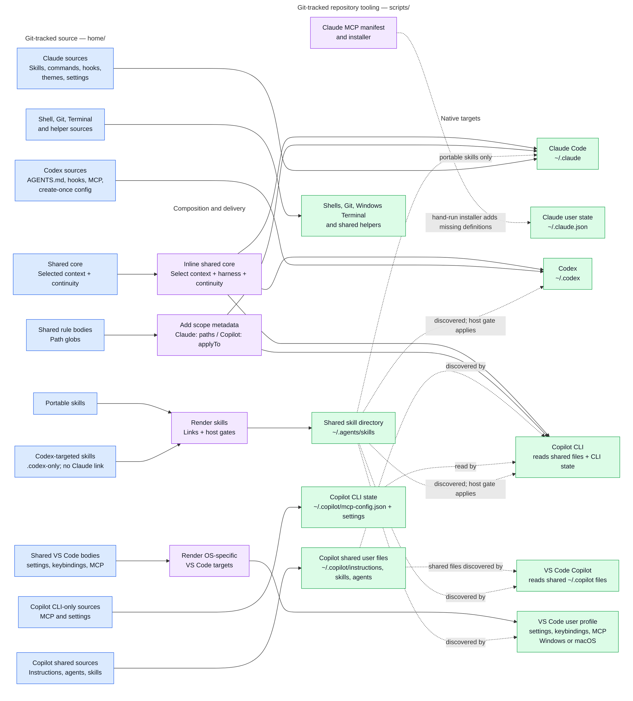
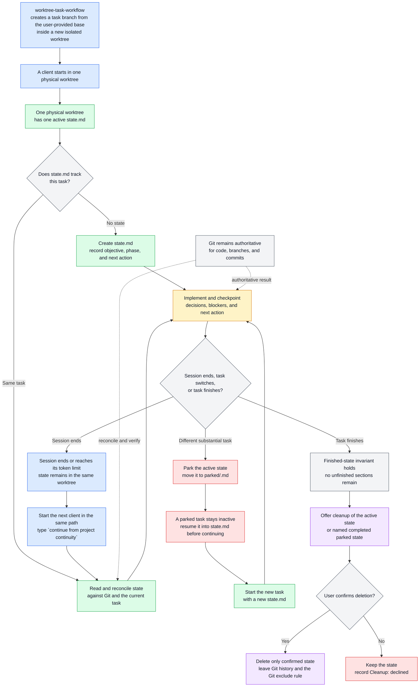
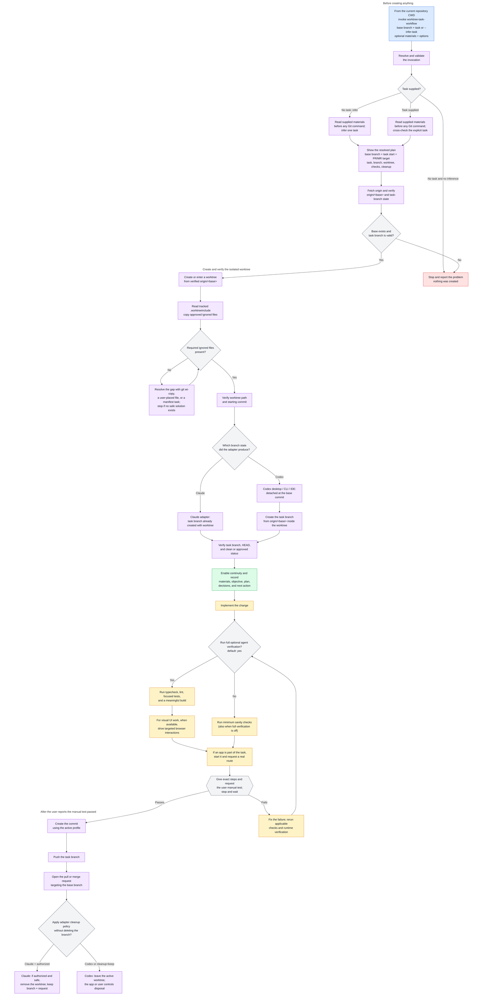
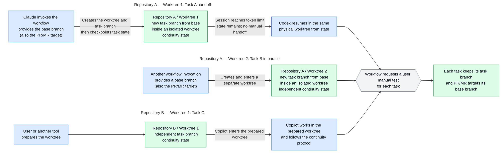

# Personal Cross-Platform Developer Environment for Agentic Workflows

[English](README.md) · [繁體中文](README.zh-TW.md)

> **TL;DR:** A cross-platform developer environment with an agentic workflow system for isolated
> parallel development, cross-client AI handoff, automated verification, and reproducible configuration.
> Managed with [chezmoi](https://www.chezmoi.io/), it includes dotfiles and AI-client integrations for
> Claude Code, Codex, and GitHub Copilot, alongside developer settings for VS Code, Zsh, Git, Windows
> Terminal, and more. One Git-tracked source tree renders the native files each tool actually reads.
> It keeps one body per shared rule instead of three drifting copies, preserves per-worktree task state
> across sessions, and leaves application-owned settings local.

```text
home/dot_bashrc  ──chezmoi apply──▶  ~/.bashrc
```

Git tracking is only the foundation. The important boundary is what this repository owns and what
it leaves to each application; chezmoi merges selected keys, Git excludes private state, and
pre-commit checks enforce that boundary.

## Why this exists

| The problem | How this repository answers it |
| --- | --- |
| Claude Code, Codex, and Copilot use different instruction files and scopes, so shared AI coding guidance can drift. | Keep reusable AI instructions once, keep client-exclusive content in native client sources, and let chezmoi render each client's format with a pre-commit parity check. |
| Repository-managed settings and application preferences can overwrite each other when both treat an entire file as authoritative. | Claim keys rather than files: deep-merge repository-owned keys, create defaults only when files are absent, and leave application-owned preferences local. |
| A session can end before handoff; parallel tasks need isolated worktrees so each keeps its own files, branch, and continuity state. | Keep Git authoritative for code and branch state; use one ignored continuity file per worktree for handoff context, and give each task its own directory and branch. |
| The same setting is stored at a different path on each operating system. | Render each OS-specific target conditionally from the same source, so Windows and macOS receive only the paths they use. |
| A restored checkout may still lack the tools and integrations it needs to run. | Use bootstrap scripts, manifests, diagnostics, and a second pass after applications are installed to restore supporting tools and integrations. |

## Set up a machine

Use the [setup guide](./docs/setup.md) for both fresh machines and existing installations. It
covers preserving existing configuration, application installation, bootstrap, machine-local
profiles, and validation. On a machine with existing settings, review `chezmoi diff` before
applying anything.

## Architecture: one source, native outputs

Chezmoi treats the files under `home/` as **source state**: the desired configuration that you
edit and commit. The files written into the home directory are **targets**: what applications
actually read.

The repository root holds a `.chezmoiroot` file naming `home/` as that source state, which is why
every managed file sits under `home/` and why applying this repository creates no `~/home/`
directory.

The source filename carries meaning. `dot_` becomes a leading `.`, `.tmpl` enables template
rendering, and prefixes such as `create_`, `modify_`, and `symlink_` control how chezmoi treats a
target. Read [the chezmoi workflow](./docs/chezmoi-workflow.md) before adding or renaming a
source file.

Claude Code, Codex, and GitHub Copilot discover instructions through different native files and
scope rules. The architecture below shows how chezmoi and the hand-run Claude MCP installer turn
reusable and client-exclusive sources into each client's native output.

**Figure: how each kind of tracked source reaches its native target.** Solid arrows show chezmoi
rendering. Dotted arrows show links, discovery, or the hand-run Claude MCP installer; each dotted
arrow is labeled with its specific meaning.

The figures use a shared color key: blue marks sources, actors, entry points, and handoffs; purple
marks orchestration, adapters, publishing, and cleanup; green marks state, worktrees, and native
outputs; amber marks active work and verification; gray marks decisions and Git authority; and red
marks blocked or parked paths.



Three details explain most of the structure:

- **Shared instructions are inlined, not imported.** Each client's native instruction file receives the
  same body. Codex receives the always-on core only, because Codex supports neither imports nor
  path-scoped instructions.
- **A portable skill is one real file.** It lives under `home/dot_agents/skills/` and renders to
  `~/.agents/skills`, where Codex, Copilot, and VS Code find it natively. Claude Code reads
  personal skills only from `~/.claude/skills`, so it reaches the same file through an individual
  symlink. A `.codex-only` marker stops the shared copy of a skill being auto-invoked by a host it
  was not written for; a client needing its own version carries a native one instead of a symlink.
- **VS Code is the editor host, not a fourth Copilot.** Its settings, keybindings, and MCP files
  use OS-specific wrappers, while Copilot instructions, agents, and skills stay in the locations
  their own host supports.

### Why some content is shared and some is not

| Content | Representation |
| --- | --- |
| Always-on working agreement | One shared body, inlined into Claude `CLAUDE.md`, Codex `AGENTS.md`, and Copilot instructions. The context layer and the continuity instructions are composed in or out by machine-local selectors, so one source yields a different agreement on a personal machine and a company one. |
| Path-scoped rules | One body and one glob in `home/.chezmoidata.yaml`, with thin Claude and Copilot frontmatter wrappers. Codex has no equivalent path-scoped output. |
| Portable skills | One real skill directory under `home/dot_agents/skills/`, rendered once to the shared discovery target and reached by Claude through a symlink. A `.codex-only` marker plus native metadata gates a Codex-targeted skill: Codex invokes it implicitly, Copilot discovers it but cannot invoke it automatically, and Claude gets no symlink because it carries its own adapter. |
| Client-specific skills, agents, commands, and MCP files | Native files under the relevant client source directory, never rewritten into a misleading "tool-neutral" copy. |
| VS Code files | Shared bodies under `home/.chezmoitemplates/vscode/`, wrapped once for the Windows and macOS user-profile paths. |

Files under `home/.chezmoitemplates/` are reusable bodies, not targets; a body normally needs its
client or OS wrapper to render. The [AI customization guide](./docs/customization-support.md)
maps every customization to the source path that owns it, and to the surfaces that read it.

## Machine-local profiles and continuity

Two independent inputs and one managed-mode option in chezmoi's machine-local configuration select
the rendered AI profile. None of them is ever committed:

```toml
[data]
ai_context = "company"        # personal or company
ai_continuity = "on"          # on or off
ai_harness = "managed"         # managed or native
```

| Selector | Controls | Default and boundary |
| --- | --- | --- |
| `ai_context` | The personal or company context layer, its artifact-language default, and the default comment language for application and project repositories. | Missing means `personal`; any other value fails rendering. |
| `ai_continuity` | Managed-mode option: whether continuity guidance and lifecycle reporting are enabled. | Missing means `on`; any other value fails rendering. Native mode suppresses the effective behavior but preserves the value. |
| `ai_harness` | Whether the complete managed harness or the low-opinionated native layer is selected. | Missing means `managed`; any other value fails rendering. `ai_workflow` is accepted only as a legacy alias. |

The composition is:

```text
shared baseline + personal OR company context
managed harness behavior when `ai_harness = "managed"`
continuity guidance and lifecycle reporting when managed + `ai_continuity = "on"`
```

`ai_continuity` stores the continuity preference, but continuity guidance and lifecycle reporting
are effective only when it is `on` and `ai_harness = "managed"`. Managed mode also registers
notifications and Claude's automatic worktree-launch check. Native mode keeps shared instructions,
reusable skills, the statusline, lightweight notifications, delivery wrappers, and private-file
protections, but does not load continuity guidance or register continuity/worktree lifecycle hooks.
The stored continuity preference is unchanged, so returning to managed mode can re-enable it.
General shell, Git, VS Code, and Windows Terminal settings remain outside this selector, and
workflow skills remain available as explicit opt-ins in either mode. State-changing workflow skills
never start implicitly; managed lifecycle hooks report events without starting a worktree or
changing source state.

A selector change affects newly rendered configuration and newly started sessions; a running
session keeps its startup context. Repository and direct user instructions still take precedence,
and this repository's root `AGENTS.md` deliberately requires the effective `personal` context
while work happens here, even on a machine set to `company`.

The artifact-language default has a narrow scope. It reaches commit descriptions and bodies,
worktree commit and request text, and managed VS Code Copilot commit-message guidance. It does
not translate branch names, paths, commands, user-level dotfiles, or this README. Explicit `en`
or `zhtw` arguments override it.

### Project continuity

Continuity belongs to one physical working tree, and each tree holds at most one active state:

- `.project-continuity/state.md` records the objective, phase, next action, blockers, assumptions,
  and verification state — where the work stopped and why, not project documentation.
- Claude Code and Codex get lifecycle reporting that finds existing state and flags branch or
  `HEAD` drift in managed mode when continuity is enabled. Copilot can follow the same protocol
  without an automatic hook. Native mode keeps the continuity skill available for explicit use.
- Git remains authoritative. Continuity is context and last-known state, never proof that
  something was finished.
- The state is Git-ignored for privacy and convenience. It is a local handoff file, not an
  encrypted store, which is why the workflow forbids putting credentials in it.
- Unfinished state is parked in `.project-continuity/parked/` before a different task starts, so
  one handoff never overwrites another.

The continuity state belongs to the physical directory, while the worktree task workflow creates
that directory and its task branch. The lifecycle below shows how the two systems connect.

**Figure: project-continuity lifecycle and its connection to isolated worktrees.**



The worktree workflow supplies the isolated physical directory. Project continuity then keeps the
unfinished task state in that directory, regardless of which supported client opens it next. A
session handoff preserves `state.md`; a task switch parks that file before creating a new one; a
completed task reaches cleanup only after the user confirms deletion. Git remains the authority for
the code and branch, so continuity never replaces a commit, branch, or pull request.

For example, after a Codex session reaches its token limit, open a new Codex session in the same
worktree and type `continue from project continuity`. Codex reads `.project-continuity/state.md`
and resumes from the recorded next action.

Turning `ai_continuity` off removes the always-loaded guidance and continuity hook, while managed
notifications and Claude's worktree-launch check remain. `ai_harness = "native"` removes
continuity/worktree lifecycle hooks and continuity guidance, while retaining the statusline,
lightweight notifications, shared instructions, reusable skills, wrappers, and protections.
Switching harness modes can require a new Codex `/hooks` approval because hook trust includes each
entry's content hash. Explicit worktree and continuity skills remain available in every combination.

### Parallel tasks without losing state

Continuity is scoped to a directory, so isolation is what lets several tasks run at once. The
`worktree-task-workflow` skill drives one task through its whole lifecycle in a worktree of its
own.

Invocation context matters. Start the workflow from the repository's current working directory
(CWD), either the primary checkout or a linked worktree. The CWD identifies the repository and
worktree context used to inspect the Git registry and provision `.worktreeinclude`. A new task
must not edit the primary checkout: when invoked there, the workflow resolves and validates the
request, then hands the client off to or provisions the isolated worktree. The client must then
run in that exact path; changing a shell's CWD does not move an existing Codex chat. From that
point, the task branch, continuity state, edits, checks, and publishing all belong to the isolated
worktree.

This workflow starts when the user invokes `worktree-task-workflow` with a base branch, a task (or
task-inference request), reference materials, and options. It creates a new worktree from
`origin/<base>`, provisions approved ignored files through `.worktreeinclude`, and creates the task
branch from that base commit. The eventual pull or merge request targets the same base branch.

`worktree-task-workflow` turns a substantial coding task into a repeatable isolated lifecycle: it
validates the starting branch, creates a dedicated worktree and task branch, preserves task context
across AI sessions, runs automated verification, requests a manual test, and publishes the change
to the correct base branch. This reduces branch and base mistakes, context loss, skipped verification,
inconsistent request targets, and setup friction when several tasks or AI clients are active at once.

**Figure: one new task's lifecycle, including material review, worktree provisioning, automated
agent verification, and the user manual-test gate.** The common contract is shown with the
Claude and Codex branch paths called out; worktree location and cleanup also differ by adapter.



The workflow gives every task its own directory, task branch, and continuity file. The user-provided
base branch is both the starting point for the task branch and the target of the eventual pull or
merge request. The workflow reads the invocation and supplied materials, shows the resolved plan,
then fetches `origin` and verifies the base before creating anything.

The worktree step is adapter-specific:

- The Claude adapter uses `git wt-add` to create the task branch and worktree together from
  `origin/<base>`, then enters that path with `EnterWorktree`.
- Codex desktop uses Handoff to create a detached worktree and copy `.worktreeinclude`. Codex CLI
  and the IDE extension provision a detached worktree, report its path, and start or resume Codex
  there before creating the task branch from the base commit.

For terminal Git, creating the worktree before reading `.worktreeinclude` is intentional:
`git wt-add` creates the destination first, then reads the tracked manifest and copies approved
Git-ignored files. If required files are missing, the workflow uses `git wt-copy`, asks for a
specific user-placed file, or offers the `worktree-manifest` skill as a scoped task. It stops when
the gap has no safe resolution.

If a session ends because it reaches its token limit, the next client can start in the same path
and read the recorded objective, decisions, materials, blockers, and next action without a manual
handoff document. `agent-test=true` runs typecheck, lint, focused tests, a meaningful build, and a
targeted browser or runtime pass for visual work when available. `agent-test=false` still runs
minimum sanity checks. When an app is part of the task, runtime verification starts it and requests
a real route; targeted browser interactions exercise a selected UI flow. Neither replaces the
manual test.

The manual-test node gives the user the exact path, startup command, route, preconditions, actions,
and expected results, then stops and waits. Only after the user reports a passing manual test does
the workflow create the commit, push the task branch, and open a request targeting the base branch.
Claude may remove the worktree after its safety checks; Codex leaves its active worktree to the app
or user. Neither adapter deletes the task branch.

The linked [worktree provisioning guide](./docs/worktree-provisioning.md#what-the-task-workflow-does-at-each-step)
covers material handling, branch naming, `.worktreeinclude` provisioning, browser-driver limits,
and branch-preserving cleanup.

Project materials are part of the workflow. Before creating a worktree, the workflow reads
supplied specifications, handoff notes, reference documents, and test inputs, classifies them, and
records their paths in continuity. When filing is needed, durable references go in
`~/Documents/reference-docs/{repo}/`, bulky or cross-worktree manual-test inputs go in
`~/Documents/test-files/{repo}/`, and agent-authored briefs without a canonical destination go in
`~/Documents/handoff/{repo}/`. Current task state stays in the worktree's ignored
`.project-continuity/state.md`; durable test procedures and fixtures stay in the repository.
Artifacts with a canonical destination, such as an MR description, stay there instead of being
duplicated.

**Figure: Repository A runs parallel worktrees, while one task crosses clients through continuity
state.**



Task A shows the central handoff: Claude invokes the workflow with a base branch, which is both the
starting point for the task branch and the eventual PR/MR target. The workflow creates and enters an
isolated worktree, then checkpoints the task state there. When the AI session reaches its token limit,
Codex starts in the same physical path and reads the existing continuity state. Task B is another
workflow invocation in the same repository, with its own base-derived branch, worktree, and state.
Task C represents a worktree prepared by the user or another tool; Copilot works there and follows
the continuity protocol but does not currently have an automatic worktree adapter. Git remains the
source of truth for code, branches, and commits; continuity supplies only the objective, decisions,
blockers, materials, and next action that Git cannot hold.

Sessions are disposable; worktrees, branches, and continuity state survive them. Claude may remove
its client-managed worktree after the safety checks, while Codex leaves its active worktree to the
application or user. The task branch and its PR/MR remain available for review in either case, and
cleanup never deletes the task branch. Copilot can follow the same continuity protocol after entering
a prepared worktree, but this repository's automatic worktree adapters currently target Claude Code
and Codex.

The manual-test gate is the part that does not parallelize. Agents fan out; verification converges
on the user's manual test.

The skill has a Claude adapter and a Codex adapter because neither client alone provides the same
isolated-task path: Claude creates and enters its managed worktree, while Codex creates or enters a
detached worktree and then creates the task branch from the selected base. A fresh worktree also
carries no ignored files, so the `worktree-manifest` skill authors the approved `.worktreeinclude`
that `git wt-add` provisions from. [The worktree provisioning guide](./docs/worktree-provisioning.md)
covers both adapters and the separate Copilot protocol.

This repository is itself an exception: it stays in its primary checkout, because chezmoi
source resolution is tied to that one tree.

## What is managed

| Surface | Representative contents |
| --- | --- |
| Claude Code | Shared `CLAUDE.md`, path-scoped rules, linked skills, Claude-only skills and commands, hooks, theme definitions, a cross-platform status line and notifications, and selected durable settings. |
| Codex | Shared `AGENTS.md`, lifecycle hooks, shared and host-gated skills, and create-once configuration defaults. |
| GitHub Copilot CLI | Shared instructions, Copilot-only agents and skills, settings, and user MCP declarations. |
| VS Code | Windows and macOS user settings, keybindings, MCP configuration, an extension manifest, and supported Copilot customizations. |
| Shells and Git | Bash, Zsh, profile startup, lazy `nvm` loading, Git identity and aliases, and the `git wt-add` / `git wt-copy` worktree commands. |
| Windows Terminal | Durable font and input behavior plus the complete actions and keybindings arrays, while generated machine-specific profiles stay application-owned. |
| Repository tooling | Bootstrap scripts, Claude MCP installers, MCP, extension, and workflow manifests, diagnostics, cross-platform helpers, workflow archive and deletion tooling, regression suites, and architecture decision records. |

The portable skill library covers accessibility review, browser collaboration, Word, PowerPoint,
Excel and PDF handling, commit conventions and commit authoring, natural Traditional Chinese,
prompt optimization, technical writing, project continuity, worktree manifests, the worktree task
workflow, and workflow archive/restore/delete. Client-only skills sit beside them where a workflow depends
on one client's machinery. Copilot adds repository-architecture, frontend-performance, and
security-review agents.

This list is representative. New applications, dotfiles, integrations, and AI-client adapters
follow the same source-to-native-target model.

The developer-experience layer includes a cross-platform Claude status line:


The status line shows the model and effort level, session name, working directory, Git branch and
file status, context usage, and the **five-hour and seven-day rate-limit windows with their reset
times**. Bash and PowerShell implementations are parity-checked and measure CJK and emoji width,
so the layout remains readable on narrow terminals.

## Ownership boundaries

The repository does not try to own every byte an application writes. It uses the narrowest useful
ownership model:

Claude Code's `/config` command, Windows Terminal, and Codex all write application-owned choices
into files this repository also touches. The repository therefore claims keys rather than files:
modify templates deep-merge owned keys, create-once sources apply defaults only when files are
absent, and whole-array ownership is used only when partial merging would be meaningless. The
table shows the boundary for each managed target.

| Target | Repository owns | Application or user owns |
| --- | --- | --- |
| Claude `settings.json` | Durable environment, hooks, status line, and update-channel values, deep-merged by a modify template. | Model, effort level, the selected theme, permissions, plugin enablement, project state, and future keys. |
| Codex `config.toml` | Defaults for a machine where the file does not yet exist. | Existing trust, runtime, marketplace, and session state. The `create_` attribute prevents wholesale replacement. |
| Windows Terminal `settings.json` | Selected durable values plus the complete `actions` and `keybindings` arrays. | Generated profiles and other unnamed settings. A claimed array is replaced whole on apply. |
| VS Code user files | Tracked settings, keybindings, and MCP sources rendered through OS-specific wrappers. | Workspace storage, authentication, extension caches, and runtime data. |
| Claude user MCP state | Non-secret declarations, through a manifest and an add-missing installer. | Authentication and the rest of `~/.claude.json`, which also holds application state. |

A second layer keeps private files from being committed by accident. The global Git exclude file
is wired through `core.excludesFile` and protects these exact surfaces in every repository:

```text
**/.claude/settings.local.json
**/CLAUDE.local.md
**/AGENTS.override.md
/.project-continuity/
```

Shared `AGENTS.md`, `CLAUDE.md`, `.github/copilot-instructions.md`, and other repository
instructions stay trackable. The ignore policy prevents accidental tracking; it does not copy
files into worktrees and does not encrypt anything.

That global file is one of two layers, which is why continuity appears in both. It covers every
repository on the machine. Inside a repository, the continuity skill also writes
`/.project-continuity/` into `.git/info/exclude`, and because that file lives in the common Git
directory the single entry covers the main checkout and every worktree, including ones created
later.

Never commit credentials. MCP configuration holds endpoints and, where supported, placeholders
such as `${input:figma-api-key}` or `${GITHUB_MCP_TOKEN}` — never their values. Authenticate each
client locally and keep sessions, logs, caches, installed plugins, and keys out of `home/`.

## Working in it day to day

Edit the source state, preview with `chezmoi diff`, apply only what you reviewed, then commit the
source. Always confirm first that chezmoi's configured source is this checkout: a plain chezmoi
command uses that directory whatever the current directory is, so an unverified `apply` can render
a different clone over this machine's configuration. The commands, the `dotf` shell aliases, and
`bash scripts/dev-env doctor` are in [the chezmoi workflow
guide](./docs/chezmoi-workflow.md#daily-commands).

The repository is also self-describing for coding assistants. The root [`AGENTS.md`](./AGENTS.md)
tells Codex and Copilot how to find the source of truth, preserve application-owned state, and
keep editing, applying, committing, and validation separate; the root
[`CLAUDE.md`](./CLAUDE.md) imports the same guidance for Claude Code. Ask by outcome:

- "I changed the live `.bashrc`; help me preserve it in the source state."
- "Add a rule shared by Claude Code and Copilot, and explain what Codex can support."
- "Set a VS Code setting, show the diff, and apply only that reviewed change."

## Validation and regression coverage

The pre-commit hook renders the staged source into a temporary directory — never into the home
directory — and checks:

- the chezmoi source identity, so a commit cannot be made against a different clone;
- every path the commit will contain, because Git commits the index rather than the paths a
  session staged, and this folder's index is shared by every process working in it;
- filename-attribute safety and skill file-count parity, so chezmoi's filename transformations
  cannot silently drop a file;
- Claude shared-skill symlinks and Codex host gates for `.codex-only` skills;
- byte-identical shared rule bodies between Claude and Copilot;
- the absence of YAML frontmatter in Codex's rendered `AGENTS.md`;
- parity between the Bash and PowerShell status-line implementations when either changes; and
- every relative Markdown link: the file it names must exist, and a `#fragment` must match a real
  heading. Both fail silently, staying rendered until a reader clicks.

Durable suites run by hand when their protected behavior changes:

| Change | Test |
| --- | --- |
| Windows worktree implementation | `powershell.exe -NoProfile -ExecutionPolicy Bypass -File scripts/tests/test-git-worktree-provision.ps1` |
| macOS worktree implementation | `bash scripts/tests/test-git-worktree-provision.sh` |
| Shared worktree contract or safety boundary | Run both worktree provisioning suites. |
| Project-continuity lifecycle or recovery contract | `bash scripts/tests/test-project-continuity-hook.sh` |
| AI profile selectors, composition, language defaults, or continuity toggle | `bash scripts/tests/test-ai-configuration-profiles.sh` |
| Workflow archive, restore, and deletion contract | `bash scripts/tests/test-workflow-archive.sh` |

Instructions get tested too. `scripts/tests/continuity-fixtures/` holds paired prompts and
expected behavior for the cases continuity handling gets wrong — an unrelated question arriving
over live state, a substantive task switch, an explicit abandon, branch drift, a finished task,
a cold start with nothing but a plan, an unverified material attribution, and a bounded negative
search claim, and an Artifact-only handoff. Each fixture stages a throwaway repository through
`setup-case.sh`, including the client-local instruction boundary in both directions. The fabricated
`state.md` files are deliberately indistinguishable from real
ones, so never act on a `state.md` found under that directory.

## Repository layout

```text
home/                              chezmoi source state
  .chezmoidata.yaml                shared rule globs
  .chezmoitemplates/               shared bodies and OS-neutral data
  dot_agents/skills/               portable and host-gated skills
  dot_claude/                      Claude Code files and adapters
  dot_codex/                       Codex files and create-once config
  dot_copilot/                     Copilot CLI files, agents, and skills
  AppData/ · Library/              Windows and macOS VS Code targets
  dot_bashrc · dot_zshrc.tmpl      shell startup files
  dot_gitconfig.tmpl               Git identity, aliases, and global excludes link
  dot_config/git/ignore            personal AI and continuity excludes
  dot_local/share/                 worktree provisioning and notification helpers

scripts/bootstrap/                 manual new-machine setup
scripts/install/                   Claude MCP installers
scripts/manifests/                 MCP, VS Code extension, and workflow declarations
scripts/workflows/                 repository workflow archive and deletion tooling
scripts/diagnostics/               doctor, config-usage, and settings-drift reports
scripts/tests/                     profile, continuity, and worktree suites
scripts/git-hooks/                 pre-commit and Markdown link validation
archives/workflows/                tracked reusable workflow archives
docs/                              setup, workflow, customization, and ADR guides
```

## Where to go next

| I want to… | Read |
| --- | --- |
| Add, change, or remove a general managed file, or run the daily commands | [docs/chezmoi-workflow.md](./docs/chezmoi-workflow.md) |
| Add an AI instruction, skill, agent, prompt, MCP server, or plugin | [docs/customization-support.md](./docs/customization-support.md) |
| Find out which client surface reads a given customization | [the support table](./docs/customization-support.md#what-the-support-table-answers) |
| Run an isolated task or provision ignored local files in a worktree | [docs/worktree-provisioning.md](./docs/worktree-provisioning.md) |
| Archive, restore, or delete a reusable workflow | [docs/workflow-archives.md](./docs/workflow-archives.md) |
| Understand why the repository uses this structure | [docs/decisions/README.md](./docs/decisions/README.md) |
| Understand why a rule exists before removing it | [docs/rule-rationale.md](./docs/rule-rationale.md) |
| Let a coding assistant work safely in this repository | [AGENTS.md](./AGENTS.md) |

Every structural choice here has a written reason. The decision records cover why procedures and
decisions live apart, why shared content uses thin wrappers, why Claude settings are merged by key
rather than replaced, why the working tree stays at `~/dotfiles`, why a Codex-targeted skill is
gated by host rather than by directory, why workflow archives use bounded discovery and explicit
inventories outside active source and discovery paths, and why the whole tree is normalized to LF. Each record
names the change that should trigger reconsideration, so a later session can tell a deliberate
constraint from accidental legacy.

Discovery paths, frontmatter keys, hook payloads, and worktree behavior all change with upstream
releases. Verify version-sensitive details against the current
[chezmoi](https://www.chezmoi.io/reference/source-state-attributes/),
[Claude Code](https://code.claude.com/docs/en/overview),
[Codex](https://learn.chatgpt.com/docs/agent-configuration/agents-md), and
[VS Code agent customization](https://code.visualstudio.com/docs/agent-customization/overview)
documentation before changing a client-specific path or key.
