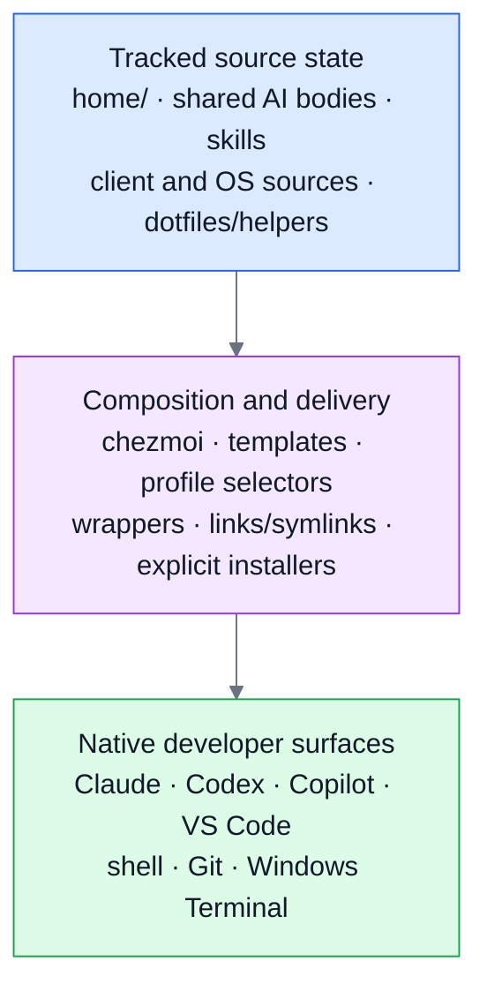
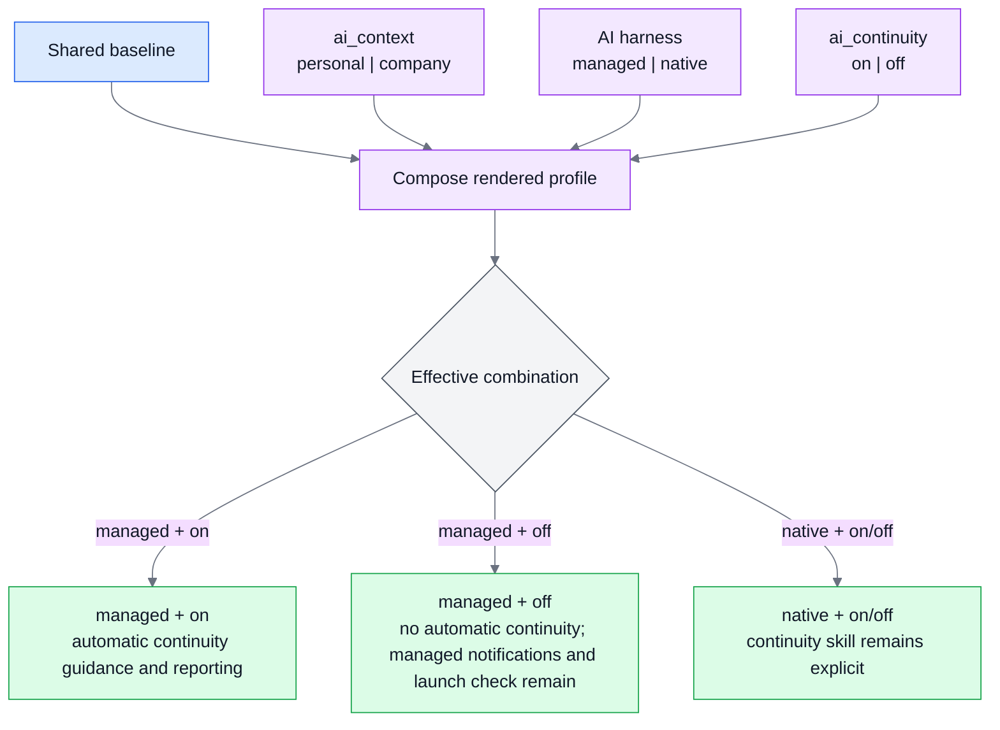
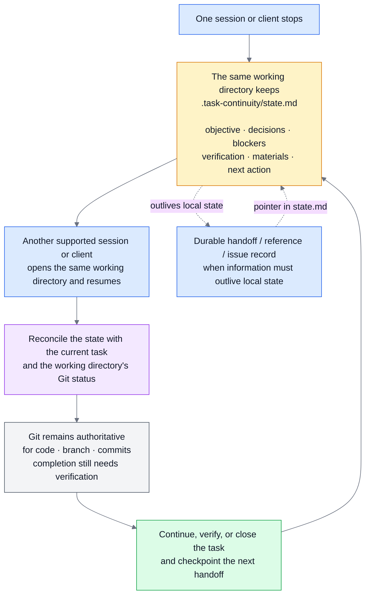
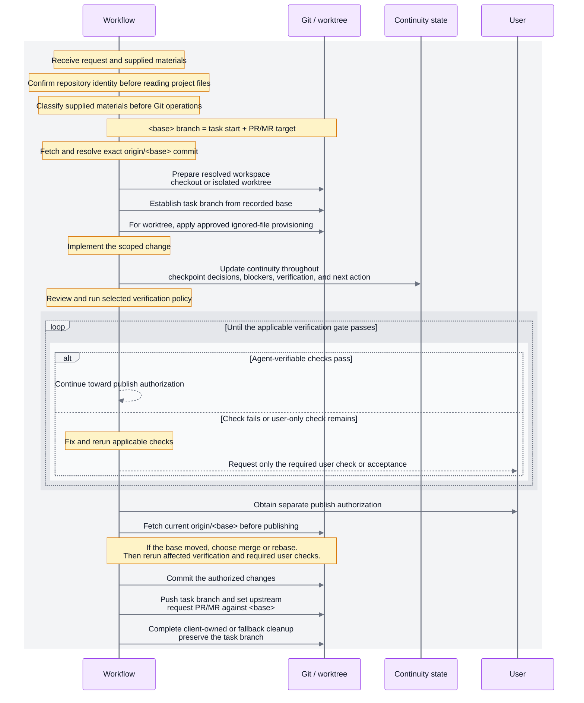

# Personal Cross-Platform Developer Environment for Agentic Workflows

[English](README.md) · [繁體中文](README.zh-TW.md)

I use this repository as the single source for my development environment, bringing my personal dotfiles and AI tooling together in one Git-tracked repository. [Chezmoi](https://www.chezmoi.io/) renders that managed source into the native files expected by each supported tool and operating system. Shared AI instructions and reusable workflows can therefore be defined once and delivered to Claude Code, Codex, and GitHub Copilot, while behavior that only belongs to one client can stay scoped there. This gives me fine-grained control without maintaining duplicate copies across AI clients and worrying about them drifting out of sync. The repository also manages only the durable settings I intentionally own, while volatile preferences, authentication, session state, and other application-owned data stay local.

Git’s built-in worktree support already provides strong source-code isolation, and AI clients such as Claude Code can build on it with native worktree creation and lifecycle support. However, several problems still appear when multiple AI-assisted tasks need to run reliably in parallel: a fresh worktree may be missing ignored local files, multiple app instances can compete for the same runtime port, and task context that Git does not capture can remain tied to a particular session or client.

My workflow fills those gaps by provisioning the approved local files each task needs, giving parallel worktrees separate runtime ports when the project provides the required runtime configuration, and keeping a per-working-directory continuity record. It deliberately separates code state from task state: Git remains authoritative for code, branches, and commits, while the continuity record preserves the story around that state — what the task is trying to accomplish, why decisions were made, what is blocked or verified, which relevant materials and references are part of the task, and what should happen next. Because that record belongs to the task rather than one conversation, another session or supported AI client can open the same working directory and resume with a simple “continue.” Policy-driven verification and explicit publish authorization provide separate gates before the branch is published for review.

**Jump to:**

* [What the workflow automates](#what-the-workflow-automates)
* [System at a glance](#system-at-a-glance)
* [Task continuity](#task-continuity)
* [Task lifecycle and workspaces](#task-lifecycle-and-workspaces)

> ⚠️ **Personal configuration:** This repository contains my preferences, not a neutral default.
> On an existing machine, review `chezmoi diff` and apply only the targets you intend to change.
> Apply the repository broadly only where replacing these personal values is acceptable.

## What the workflow automates

| Without the workflow — I have to                                                                                                | With the workflow — the system will                                                                                                                                                                                                                                                                                                  |
| ------------------------------------------------------------------------------------------------------------------------------- | ------------------------------------------------------------------------------------------------------------------------------------------------------------------------------------------------------------------------------------------------------------------------------------------------------------------------------------ |
| Reconstruct or re-explain task context when resuming work in a new session                                                      | Preserve task context across sessions. Keep per-working-directory continuity state containing the objective, phase, decisions, assumptions, blockers, verification state, task identity, and next action, so another session or supported AI client can reconcile the state with the working directory and Git and continue the task |
| Track which specifications, screenshots, spreadsheets, test inputs, handoffs, and other materials relate to each task           | Organize and associate materials with tasks. Separate stable task materials, reusable test materials, and durable handoffs from transient task state while recording their paths and provenance                                                                                                                                      |
| Create and prepare a separate worktree and branch each time I want to work on another task from the same repository in parallel | Prepare isolated task workspaces. Resolve the base and task branch, create or select the workspace, provision approved ignored/local files into worktrees, and keep each task's branch, working directory, and continuity state independent                                                                                          |
| Choose and keep track of separate runtime ports so multiple task environments can run at the same time without port collisions  | Handle runtime isolation. Use project runtime configuration to allocate separate ports automatically, allowing isolated worktrees to run and test independent application instances without port collisions                                                                                                                          |
| Decide what the agent can verify itself, what still needs my checking, and what must be rerun after a failure                   | Coordinate verification. Apply the selected verification policy across feasible automated, runtime, browser, and interactive checks, loop through fix-and-retest when needed, and request only checks or acceptance that actually require me                                                                                         |
| Coordinate the path from completed implementation to reviewable work                                                            | Coordinate publication. Keep verification separate from publish authorization, refresh and reconcile the target base before publication, rerun affected verification when necessary, then commit, push, request review, and perform branch-preserving cleanup                                                                        |

## Core Capabilities

| Pillar                                 | Result                                                                                                                                                                                                                                          |
| -------------------------------------- | ----------------------------------------------------------------------------------------------------------------------------------------------------------------------------------------------------------------------------------------------- |
| One source, native targets             | Shared AI instructions and reusable AI skills have one source body. Thin wrappers preserve each client's native discovery and scope rules.                                                                                                      |
| Profiles without duplicated trees      | Machine-local selectors compose personal or company context with a managed or native AI harness, plus an independent continuity preference.                                                                                                     |
| Continuity across sessions and clients | One `.task-continuity/state.md` stays with one working directory so another supported session can resume from the same objective, decisions, blockers, materials, verification state, and next action.                                      |
| Scoped, reviewable tasks               | An explicit workflow resolves a workspace and task branch from a base, provisions approved ignored files only for isolated worktrees, applies a verification policy, and requires separate publish authorization before publication. |

Ownership boundaries and validation support all four pillars; they are guarantees across the system,
not a separate fifth pillar.

The repository also keeps application-owned preferences local, supports Windows and macOS paths,
and records architectural trade-offs in [decision records](./docs/decisions/README.md).

## In practice

The workflow exposes one primary entry point across supported AI clients: `/run-task-end-to-end`.

Start with guided mode when you want the workflow to walk you through the choices. Invoke `/run-task-end-to-end` with no arguments.

No-argument mode asks for the task, workspace, base, verification policy, continuity policy, and any context-specific required input. It uses native choice UI when the client provides one and a concise text fallback otherwise. It shows `agent` and `auto` as the defaults for verification and continuity, but guided mode still exposes those choices.

Use the prompted form when you want to describe the task naturally. Append the request to `/run-task-end-to-end`, for example:

`/run-task-end-to-end Use a worktree from feature/example and implement the changes from the attached specification.`

The workflow parses only clear values, such as `workspace=worktree` and `base=feature/example`, and asks only for unresolved choices. Prompt-derived values remain marked as `prompt`; confirmed answers are marked as `confirmation` in the resolved echo.

Use explicit arguments for deterministic or power-user operation:

`/run-task-end-to-end workspace=checkout base=main task="Fix the README wording"`

`/run-task-end-to-end workspace=worktree base=feature/example task="Implement the changes from the attached specification"`

Partial structured input is also supported. For example, `/run-task-end-to-end workspace=worktree task="Implement the example feature"` keeps the explicit workspace and task, then asks only for the remaining required base. Explicit values bypass redundant questions.

Context-specific repository policies can require additional task or branch metadata. When they do, the workflow requires that information explicitly rather than inferring internal conventions from branch names or task text. Project-specific branch exceptions must likewise be declared in repository instructions and supplied explicitly.

Legacy workflow entry points remain available for compatibility, but they are not the primary invocation path.

## System at a glance

`home/` is the chezmoi source state for this repository's dotfiles and AI configuration. [Chezmoi](https://www.chezmoi.io/)
renders that source into native targets that applications read. `scripts/` and `docs/` support both
the configuration and workflow planes with bootstrap, diagnostics, installers, tests, and decision
records.

The diagram shows the configuration plane only: tracked source state flows through composition and
native delivery to the surfaces that tools read. Task continuity and task execution are covered
separately below. Detailed client-to-surface mappings belong in the
[customization support guide](./docs/customization-support.md).



`home/` contains both plain chezmoi source files and templates. Reusable bodies in
`.chezmoitemplates/` feed thin client wrappers; portable skills remain a shared source and use
links or symlinks when a client needs a native discovery location. Client-specific sources stay in
their native directories.

Where supported, clients provide native worktree creation and lifecycle controls. Repository-owned
checks and fallbacks cover the remaining shared contract: an exact `origin/<base>` contract,
portable handoff state, approved ignored-file provisioning, applicable verification, separate publish
authorization, optional runtime isolation, and explicit workflow deletion with reviewed chezmoi cleanup. See [native-first worktree delegation](./docs/worktree-provisioning.md#native-first-delegation)
for the client-specific details.

## Start here

- Set up a new or existing machine with the [setup guide](./docs/setup.md). Review `chezmoi diff`
  before applying changes to an existing home directory.
- Learn the source-versus-target boundary and daily commands in the
  [chezmoi workflow](./docs/chezmoi-workflow.md).
- For a substantial or isolation-sensitive task, read the
  [worktree provisioning guide](./docs/worktree-provisioning.md).

## Profiles and AI harness modes

Three machine-local selectors change the rendered client configuration and behavior. The selectors
are not committed.

```toml
[data]
ai_context = "company"        # personal or company
ai_continuity = "on"          # on or off
ai_harness = "managed"        # managed or native
```



| Selector        | Controls                                                                                                                           | Default and boundary                                                                                                                                  |
| --------------- | ---------------------------------------------------------------------------------------------------------------------------------- | ----------------------------------------------------------------------------------------------------------------------------------------------------- |
| `ai_context`    | Personal or company context, artifact-language default, and the default comment language for application and project repositories. | Missing means `personal`; other values fail rendering.                                                                                                |
| `ai_continuity` | The managed-mode continuity preference.                                                                                            | Missing means `on`; `off` removes automatic continuity guidance and reporting. Native mode suppresses the effective behavior but preserves the value. |
| `ai_harness`    | The complete managed AI harness or the lower-opinionated native AI harness.                                                        | Missing means `managed`; other values fail rendering. `ai_workflow` remains a legacy alias only when `ai_harness` is absent.                          |

An **AI harness** is the repository's instruction, skill, lifecycle, and delivery layer around an AI
client. It is not a hosted model or model runtime. Managed mode adds repository-owned lifecycle
guidance and reporting; native mode keeps the shared AI content and client-native delivery surfaces
while leaving those workflow actions explicit.

The rendered composition is `shared baseline + context + AI harness behavior + effective continuity`.
Managed AI harness mode also adds lifecycle reporting, notifications, and Claude's worktree-launch
check. Native AI harness mode keeps shared instructions, skills, statusline, lightweight
notifications, delivery wrappers, and private-file protection, but leaves continuity and worktree
lifecycle actions explicit. Neither mode starts a state-changing workflow implicitly.

Selector changes affect newly rendered configuration and newly started sessions. This repository's
root `AGENTS.md` requires the effective `personal` context while work happens here, even on a
machine whose selector is `company`. The artifact-language default affects commit and worktree
request text and selected Copilot guidance; it does not translate branch names, paths, commands,
user-level dotfiles, or this README.

Read the [AI profile section of the chezmoi workflow](./docs/chezmoi-workflow.md#machine-local-ai-profile-selectors)
and the [customization support guide](./docs/customization-support.md#ai-profile-dimensions) for
the full composition rules.

## Task continuity

Continuity belongs to one working directory, including the primary checkout and linked worktrees. It
is a local handoff record, not project documentation and not proof that work is complete. Each
working directory has at most one active task and one `.task-continuity/state.md`; a newly created
worktree starts without another worktree's continuity state.

When a new task finds a different unfinished state, the existing task must be finished, parked, or
abandoned first. When it finds a completed active state, the workflow reconciles it through the
completion gate and moves it to `.task-continuity/parked/` with a non-colliding name. A fresh active
state can then be created for the new task when continuity is enabled; no deletion confirmation or
`continuity=off` override is required for this preservation move. Completed state is never silently
overwritten, and deleting the parked record remains a separate, confirmation-gated cleanup action.



Local continuity state is the working-session record. When information must outlive that state—or a
decision is deferred or unresolved—the workflow uses a durable handoff, reference, or issue record
and keeps its pointer in `state.md`.

The state records a short task label when known, the objective, phase, decisions, assumptions,
blockers, verification state, material references and provenance, and the next action. New workflow
records also retain the task branch, selected base branch, immutable base commit, and compatibility
`Started from` commit. Parking preserves this identity metadata; it does not reduce a task to a
filename or a branch name.

The material and continuity surfaces have distinct roles:

| Surface | Role |
| --- | --- |
| `~/Documents/task-materials/` | Stable reference inputs such as specifications, screenshots, spreadsheets, source documents, and external reference files. Stable means that the material has an identity and location intended for reuse; it does not mean immutable, and the workflow does not casually edit it. |
| `~/Documents/test-materials/` | Reusable test inputs and fixtures such as sample files, manual-test inputs, and reproducible testing artifacts. |
| `~/Documents/handoffs/` | Durable, updateable coordination records such as PM/BE notes, deferred decisions, unresolved dependencies, and ownership or status notes. |
| `.task-continuity/` | Transient operational task state: the current objective, phase, blockers, verification status, next action, and pointers to the durable materials above. |

These directories remain outside the repository and are not copied into worktrees.

When a checkout returns to a named branch with no active state, the workflow can inspect parked
records. It restores a single candidate only when the branch matches exactly, the record contains
task and start-commit metadata, the start commit is reachable from the current `HEAD`, and the
current request matches the recorded task and objective. Multiple candidates, legacy records, a
branch-only match, detached `HEAD`, or conflicting task intent require explicit selection or
confirmation. Claude Code and Codex report lifecycle events automatically in managed mode when
continuity is enabled. Copilot can follow the same protocol without an automatic lifecycle hook,
and native mode keeps the continuity skill available for explicit use.

Git remains the authority when state and the checkout disagree. Continuity never replaces a
commit, branch check, test result, or user approval. If implementation differs from an approved
artifact, classify the difference as accepted scope, a deferred dependency, or an unresolved
decision; the latter two need a durable handoff or issue record, with only its pointer kept in
`state.md`.

The state is Git-ignored for privacy and convenience. It is not encrypted and must not contain
credentials. When a different unfinished task starts in the same physical directory, the existing
state is parked under `.task-continuity/parked/` instead of being overwritten. See the
[worktree continuity boundary](./docs/worktree-provisioning.md#how-each-worktree-receives-ignored-files)
and the [task-continuity skill](./home/dot_agents/skills/task-continuity/SKILL.md). Legacy
`.project-continuity/` state is accepted only for one-time migration. Move the complete directory
to `.task-continuity/` only after confirming that the canonical directory does not exist; never
merge, overwrite, or delete either state directory silently.

## Source state and native targets

Chezmoi treats the files under `home/` as **source state**: the configuration this repository
edits and commits. The files written into the home directory are **targets**: the files tools and
applications read. The root `.chezmoiroot` selects `home/`; applying the repository does not create
a `~/home/` directory.

When changing a managed setting, edit the source under `home/`, preview the rendered result with
`chezmoi diff`, and apply only after reviewing the target changes. Leave application-owned values in
the target unless you intentionally promote them into repository ownership.

Source filenames carry behavior. `dot_` becomes a leading `.`, `.tmpl` enables rendering, and
prefixes such as `create_`, `modify_`, and `symlink_` control target handling. Read the
[source-state rules](./docs/chezmoi-workflow.md#source-filename-rules) before adding or renaming a
source file.

The repository keeps shared content shared without pretending that clients are interchangeable:

| Content                                           | Source and delivery                                                                                                                                                                                                                        |
| ------------------------------------------------- | ------------------------------------------------------------------------------------------------------------------------------------------------------------------------------------------------------------------------------------------ |
| Shared AI instructions                            | One body is inlined into Claude, Codex, and Copilot native files. Thin wrappers add only the metadata each client supports. Codex receives no imports or path-scoped rules.                                                                |
| Portable skills                                   | One real skill under `home/dot_agents/skills/` renders to `~/.agents/skills`. Claude reaches portable skills through individual symlinks; host-gated metadata prevents a Codex-targeted skill from automatic invocation by the wrong host. |
| Client-specific skills, agents, commands, and MCP | Native files remain under the relevant client source directory. The repository does not create a misleading tool-neutral copy.                                                                                                             |
| OS-specific files                                 | Shared bodies use wrappers for Windows and macOS target paths.                                                                                                                                                                             |

The [AI customization support table](./docs/customization-support.md#what-the-support-table-answers)
maps each capability to its source path and every client surface that reads it. It also documents
the full adapter matrix, current discovery paths, and the rule for adding a Codex-targeted skill.

The main workflow skills stay focused: [run-task-end-to-end](./home/dot_agents/skills/run-task-end-to-end/SKILL.md)
coordinates the lifecycle, [task-continuity](./home/dot_agents/skills/task-continuity/SKILL.md)
owns the handoff state, and [worktree-manifest](./home/dot_agents/skills/worktree-manifest/SKILL.md)
reviews or creates the approved ignored-file allowlist. Runtime isolation remains a separate
project-provided descriptor and [focused guide](./docs/worktree-runtime.md).

## Task lifecycle and workspaces

The task workflow is an explicit opt-in for work whose branch, verification, continuity, or
publishing state benefits from a recorded lifecycle. Use `workspace=checkout` for a sequential task
that can safely use the current physical checkout, and `workspace=worktree` whenever two tasks need
independent uncommitted changes, branches, runtime ports, or processes. Workspace selection must be
explicit or clearly stated in the prompt; otherwise the workflow asks before execution and reports
the resolution source.

Both workspace modes share the same lifecycle: resolve the base and policies, prepare the workspace,
establish the task branch, implement, review, verify/fix/retest, obtain separate publish
authorization, refresh and reconcile the base, then commit/push/request and hand off or clean up.
Only the worktree mode provisions ignored files and provides separate runtime isolation.



The focused [worktree provisioning guide](./docs/worktree-provisioning.md#workflow-sequence) expands
the provisioning checks, native client paths, runtime isolation, and cleanup contract behind this
sequence.

Both workspace modes pin the task to the selected base and establish a task branch. The checkout
workspace stays in the current physical checkout. Native clients retain their own worktree
ownership; repository fallbacks provision only approved ignored files for isolated worktrees and
refuse implicit copies of tracked application configuration or external folders. The checkout
workspace does not claim worktree isolation or a separate runtime port.

The focused [worktree provisioning guide](./docs/worktree-provisioning.md#what-the-task-workflow-does-at-each-step)
carries the client paths, material handling, provisioning readiness, runtime isolation, verification,
publish-authorization gate, and branch-preserving cleanup details. Separate tasks keep their
workspaces, branches, and continuity state independent, while a client handoff reopens the same
working directory.

## What the environment delivers

The landing page shows the native surfaces and supporting boundaries; focused guides carry the full
matrices and procedures.

| Area                         | Representative contents                                                                                                                                                                                                                                                                                    |
| ---------------------------- | ---------------------------------------------------------------------------------------------------------------------------------------------------------------------------------------------------------------------------------------------------------------------------------------------------------- |
| AI clients and editor hosts  | Claude Code, Codex, GitHub Copilot CLI, and VS Code expose shared instructions, native skills and agents, MCP declarations, hooks, and selected settings; each host reads the subset it supports.                                                                                                          |
| Dotfiles and developer tools | Cross-platform shell startup, Git identity and aliases, worktree helpers, Windows Terminal values, and OS-specific VS Code targets.                                                                                                                                                                        |
| Workflow support             | Bootstrap scripts, installers, manifests, diagnostics such as `scripts/diagnostics/dev-env-doctor.sh`, regression suites, and [ADRs](./docs/decisions/README.md).                                                                                                                                          |
| Isolation and provenance     | Optional per-worktree HTTP ports with health checks and leases; classified reference and test materials with recorded paths and provenance. See [worktree runtime](./docs/worktree-runtime.md) and [workflow material handling](./docs/worktree-provisioning.md#what-the-task-workflow-does-at-each-step). |
| Parity and lifecycle         | Windows/macOS source-body parity and focused checks. Workflow deletion uses explicit tracked source inventories and chezmoi removal; continuity, secrets, and application state stay outside. See [workflow deletion](./docs/workflow-deletion.md). |

The developer-experience layer includes a cross-platform Claude status line:


The status line shows the model and effort level, session name, working directory, Git branch and
file status, context usage, and the five-hour and seven-day rate-limit windows with their reset
times. Bash and PowerShell implementations are parity-checked and measure CJK and emoji width for
narrow terminals.

## Ownership and privacy boundaries

For application-owned configuration, the repository claims the narrowest useful surface: deliberate
durable keys or structures. Volatile preferences, authentication, history, caches, session/runtime
state, and future application-owned values remain local unless intentionally promoted into repository
ownership.

| Target                           | Repository owns                                                                                   | Application or user owns                                                    |
| -------------------------------- | ------------------------------------------------------------------------------------------------- | --------------------------------------------------------------------------- |
| Claude `settings.json`           | Durable environment, hooks, status line, and update-channel values through a deep-merge template. | Model, effort, theme, permissions, plugins, project state, and future keys. |
| Codex `config.toml`              | Defaults only when the file does not exist.                                                       | Existing trust, runtime, marketplace, and session state.                    |
| Windows Terminal `settings.json` | Selected durable values and the complete `actions` and `keybindings` arrays.                      | Generated profiles and other unnamed settings.                              |
| VS Code user files               | Tracked settings, keybindings, and MCP sources through OS-specific wrappers.                      | Workspace storage, authentication, extension caches, and runtime data.      |
| Claude user MCP state            | Non-secret declarations through an add-missing installer.                                         | Authentication and the rest of `~/.claude.json`.                            |

The global Git exclude file protects private client files and continuity state from accidental
tracking:

```text
**/.claude/settings.local.json
**/CLAUDE.local.md
**/AGENTS.override.md
/.task-continuity/
```

The ignore policy does not copy files into worktrees and does not encrypt them. MCP configuration
may contain placeholders such as `\${input:figma-api-key}` or `\${GITHUB_MCP_TOKEN}`, never their
values. Authenticate clients locally and keep credentials out of `home/`.

## Validation and regression coverage

The repository uses local automated suites under a policy-driven verification contract and a separate
publish-authorization gate. No repository CI workflow is configured, so a passing local suite is not
a claim that CI ran.

The pre-commit hook renders staged source into a temporary directory, never into the home directory,
and checks:

- source identity and every staged path, which matters because this checkout's Git index is shared;
- filename-attribute safety and skill file-count parity;
- Claude skill links and Codex host gates;
- byte-identical shared rule bodies between Claude and Copilot;
- no YAML frontmatter in Codex's rendered `AGENTS.md`;
- Bash and PowerShell status-line parity when either implementation changes; and
- relative Markdown links and heading fragments.

Run the focused suites by hand when the protected behavior changes:

| Behavior                                       | Local check                                                                                             |
| ---------------------------------------------- | ------------------------------------------------------------------------------------------------------- |
| Windows worktree provisioning                  | `powershell.exe -NoProfile -ExecutionPolicy Bypass -File scripts/tests/test-git-worktree-provision.ps1` |
| macOS worktree provisioning                    | `bash scripts/tests/test-git-worktree-provision.sh`                                                     |
| Continuity lifecycle and recovery              | `bash scripts/tests/test-task-continuity.sh`                                                    |
| Task workflow workspace and policy contract    | `bash scripts/tests/test-run-task-end-to-end.sh`                                                        |
| Task workflow invocation styles and host fallbacks | `bash scripts/tests/test-run-task-invocation.sh`                                                      |
| AI profile composition and selectors           | `bash scripts/tests/test-ai-configuration-profiles.sh`                                                  |
| Workflow deletion and Git recovery             | `bash scripts/tests/test-workflow-delete.sh`                                                           |
| Runtime descriptor, allocation, and port lease | `python scripts/tests/test-worktree-runtime.py -v`                                                      |

On Windows PowerShell, run Bash-based suites through
`.\scripts\tests\run-git-bash-tests.ps1`; it resolves Windows Git Bash explicitly. The continuity
fixtures under `scripts/tests/continuity-fixtures/` are manual model-behavior probes, not live
automated agent tests. They use throwaway repositories and deliberately fabricated `state.md`
files; never treat a fixture state as the real working tree state.

## Repository layout

```text
home/                              chezmoi source state
  .chezmoidata.yaml                shared rule globs
  .chezmoitemplates/               shared bodies and OS-neutral data
  dot_agents/skills/               portable and host-gated skills
  dot_claude/                      Claude Code files and adapters
  dot_codex/                       Codex files and create-once config
  dot_copilot/                     Copilot CLI files, agents, and skills
  AppData/ · Library/              Windows and macOS VS Code targets
  dot_bashrc · dot_zshrc.tmpl      shell startup files
  dot_gitconfig.tmpl               Git identity and global excludes link
  dot_config/git/ignore             private AI and continuity excludes
  dot_local/share/                 worktree, runtime, and notification helpers

scripts/bootstrap/                 manual new-machine setup
scripts/install/                   Claude MCP installers
scripts/manifests/                 MCP, VS Code extension, and workflow declarations
scripts/workflows/                 workflow deletion tooling
scripts/diagnostics/               doctor, usage, and drift reports
scripts/tests/                     profile, continuity, worktree, and runtime suites
scripts/git-hooks/                 pre-commit and Markdown link validation
docs/                              setup, workflow, customization, and ADR guides
```

## Where to go next

| I want to…                                                      | Read                                                                                |
| --------------------------------------------------------------- | ----------------------------------------------------------------------------------- |
| Set up or update the machine                                    | [docs/setup.md](./docs/setup.md)                                                    |
| Add, change, or remove a managed file                           | [docs/chezmoi-workflow.md](./docs/chezmoi-workflow.md)                              |
| Add an instruction, skill, agent, prompt, MCP server, or plugin | [docs/customization-support.md](./docs/customization-support.md)                    |
| Find which client surface reads a customization                 | [the support table](./docs/customization-support.md#what-the-support-table-answers) |
| Run an isolated task or provision ignored local files           | [docs/worktree-provisioning.md](./docs/worktree-provisioning.md)                    |
| Run parallel application instances                              | [docs/worktree-runtime.md](./docs/worktree-runtime.md)                              |
| Delete a reusable workflow source safely                         | [docs/workflow-deletion.md](./docs/workflow-deletion.md)                            |
| Understand why the repository uses this structure               | [docs/decisions/README.md](./docs/decisions/README.md)                              |
| Understand why a rule exists before removing it                 | [docs/rule-rationale.md](./docs/rule-rationale.md)                                  |
| Let a coding assistant work safely in this repository           | [AGENTS.md](./AGENTS.md)                                                            |

Every structural choice has a written reason. Read the relevant ADR before changing a
repository-wide mechanism, ownership boundary, or client integration. Discovery paths,
frontmatter keys, hook payloads, and worktree behavior change with upstream releases; verify
version-sensitive details against the current [chezmoi](https://www.chezmoi.io/reference/source-state-attributes/),
[Claude Code](https://code.claude.com/docs/en/overview),
[Codex](https://learn.chatgpt.com/docs/agent-configuration/agents-md), and
[VS Code agent customization](https://code.visualstudio.com/docs/agent-customization/overview)
documentation before changing a client-specific path or key.
