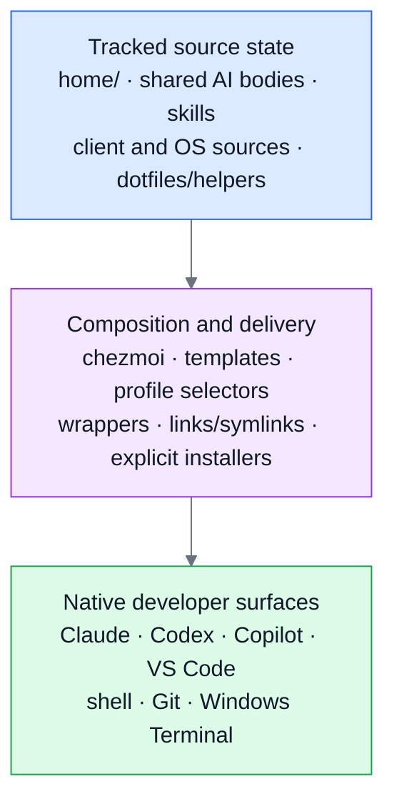
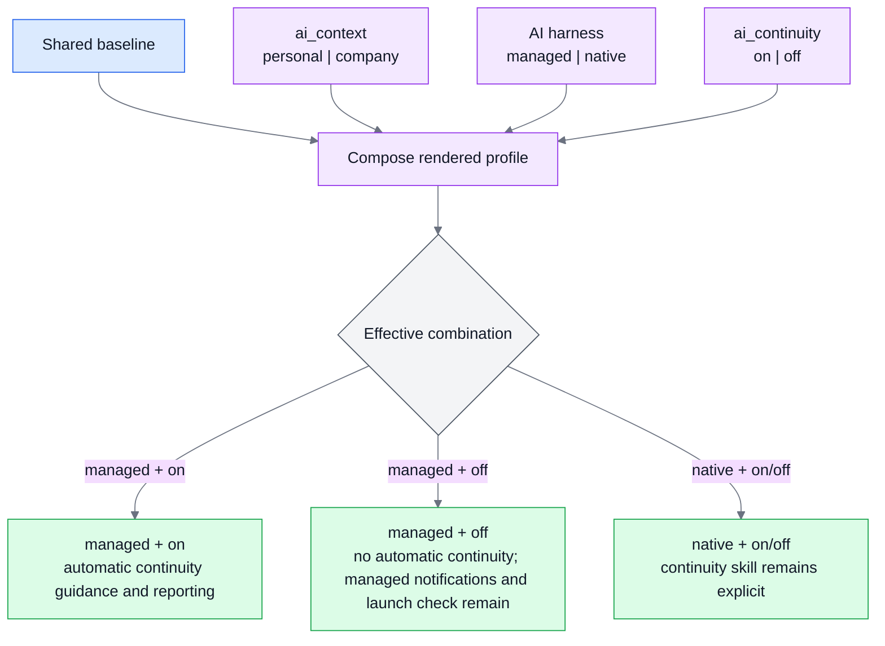
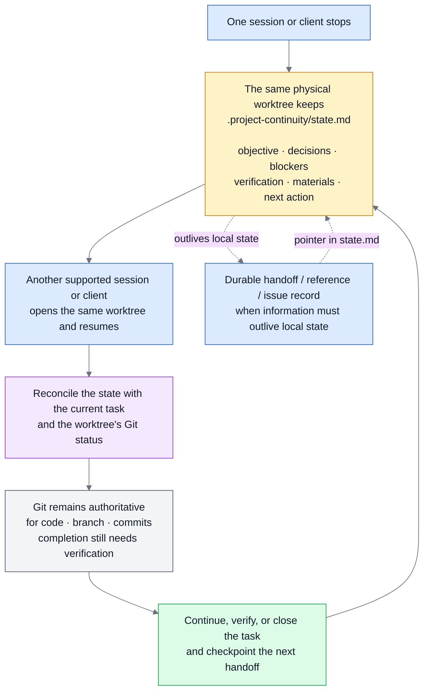
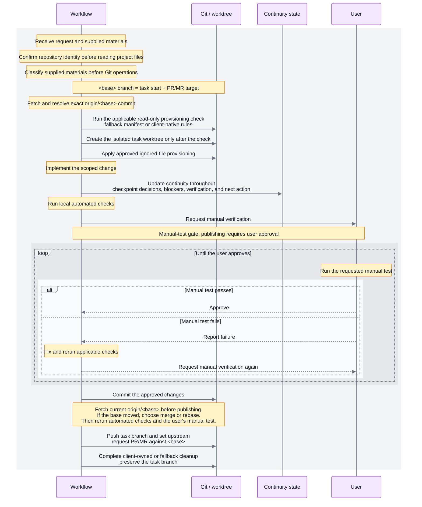

# Personal Cross-Platform Developer Environment for Agentic Workflows

[English](README.md) · [繁體中文](README.zh-TW.md)

I built this as the cross-platform development environment I use across machines and AI coding tools. At the time of writing, the supported AI clients are Claude Code, Codex, and GitHub Copilot; that list may change as the repository evolves. The environment keeps my personal dotfiles, shared AI instructions and workflow skills, and cross-client task protocols in one place while preserving each client's native files, discovery paths, and scope rules.

For longer or parallel tasks, supported clients can use isolated Git worktrees. The shared task workflow adds the repository-level contract around that isolation: approved local-file provisioning, per-worktree runtime ports, local verification, and explicit approval before publishing.

Git records the current state of the code, branch, and commits. A small per-worktree continuity record captures the state of the work: its objective, decisions, blockers, verification, inputs, and next action. It also records pointers to relevant reference documents, test files, and handoff notes when they live outside the worktree. Together, Git and continuity provide the working picture needed to resume: Git shows what exists, while continuity explains what we were trying to accomplish, why, what informed it, and how to continue.

**Jump to:**

- [In practice](#in-practice)
- [System at a glance](#system-at-a-glance)
- [Project continuity](#project-continuity)
- [Task lifecycle and isolated worktrees](#task-lifecycle-and-isolated-worktrees)
- [Profiles and AI harness modes](#profiles-and-ai-harness-modes)
- [Repository layout](#repository-layout)

> ⚠️ **Personal configuration:** This repository contains my preferences, not a neutral default.
> On an existing machine, review `chezmoi diff` and apply only the targets you intend to change.
> Apply the repository broadly only where replacing these personal values is acceptable.

## What this gives you

| Pillar | Result |
| --- | --- |
| One source, native targets | Shared AI instructions and reusable AI skills have one source body. Thin wrappers preserve each client's native discovery and scope rules. |
| Profiles without duplicated trees | Machine-local selectors compose personal or company context with a managed or native AI harness, plus an independent continuity preference. |
| Continuity across sessions and clients | One `.project-continuity/state.md` stays with one physical worktree so another supported session can resume from the same objective, decisions, blockers, materials, verification state, and next action. |
| Isolated, reviewable tasks | An explicit workflow pins the base, creates a task worktree and branch, provisions only approved ignored local files, runs local automated checks, then asks the user for a separate manual test before publishing without deleting the branch. |

Ownership boundaries and validation support all four pillars; they are guarantees across the system,
not a separate fifth pillar.

The repository also keeps application-owned preferences local, supports Windows and macOS paths,
and records architectural trade-offs in [decision records](./docs/decisions/README.md).

## In practice

Start a substantial task with a natural-language prompt, or use the explicit form when automation
or auditability needs every field named:

`$worktree-task-workflow "Implement FE-04 from the attached spec and target the MR against feat/water-fee"`

`$worktree-task-workflow <base-branch> "<task>" [materials...]`

The prompt intake resolves the task, supplied materials, and verified MR/PR target before the same
workflow begins:

`start → isolate → record context → implement → verify → manual approval → publish for review`

The workflow keeps the task directory, branch, and handoff context together, and does not publish
until automated checks and explicit manual approval are complete. Its detailed contract resolves an
exact base and MR/PR target, provisions missing approved ignored files from `.worktreeinclude` or a
client-native equivalent, and uses `runtime=auto` with a project descriptor to allocate and
health-check a per-worktree port. Questions and assessment prompts stay in a read-only planning
phase; say `proceed` or use `phase=execute` before the workflow creates a worktree. It never copies
tracked configuration or external secrets.

## System at a glance

`home/` is the chezmoi source state for this repository's dotfiles and AI configuration. [Chezmoi](https://www.chezmoi.io/)
renders that source into native targets that applications read. `scripts/` and `docs/` support both
the configuration and workflow planes with bootstrap, diagnostics, installers, tests, and decision
records.

The diagram shows the configuration plane only: tracked source state flows through composition and
native delivery to the surfaces that tools read. Project continuity and task execution are covered
separately below. Detailed client-to-surface mappings belong in the
[customization support guide](./docs/customization-support.md).

`home/` contains both plain chezmoi source files and templates. Reusable bodies in
`.chezmoitemplates/` feed thin client wrappers; portable skills remain a shared source and use
links or symlinks when a client needs a native discovery location. Client-specific sources stay in
their native directories.

Where supported, clients provide native worktree creation and lifecycle controls. Repository-owned
checks and fallbacks cover the remaining shared contract: an exact `origin/<base>` contract,
portable handoff state, approved ignored-file provisioning, focused verification, manual approval,
optional runtime isolation, and explicit workflow archives. See [native-first worktree delegation](./docs/worktree-provisioning.md#native-first-delegation)
for the client-specific details.

## Start here

- Set up a new or existing machine with the [setup guide](./docs/setup.md). Review `chezmoi diff`
  before applying changes to an existing home directory.
- Learn the source-versus-target boundary and daily commands in the
  [chezmoi workflow](./docs/chezmoi-workflow.md).
- For a substantial or isolation-sensitive task, read the
  [worktree provisioning guide](./docs/worktree-provisioning.md).

## Profiles and AI harness modes

Three machine-local selectors change the rendered client configuration and behavior. The selectors
are not committed.

~~~toml
[data]
ai_context = "company"        # personal or company
ai_continuity = "on"          # on or off
ai_harness = "managed"        # managed or native
~~~

| Selector | Controls | Default and boundary |
| --- | --- | --- |
| `ai_context` | Personal or company context, artifact-language default, and the default comment language for application and project repositories. | Missing means `personal`; other values fail rendering. |
| `ai_continuity` | The managed-mode continuity preference. | Missing means `on`; `off` removes automatic continuity guidance and reporting. Native mode suppresses the effective behavior but preserves the value. |
| `ai_harness` | The complete managed AI harness or the lower-opinionated native AI harness. | Missing means `managed`; other values fail rendering. `ai_workflow` remains a legacy alias only when `ai_harness` is absent. |

An **AI harness** is the repository's instruction, skill, lifecycle, and delivery layer around an AI
client. It is not a hosted model or model runtime. Managed mode adds repository-owned lifecycle
guidance and reporting; native mode keeps the shared AI content and client-native delivery surfaces
while leaving those workflow actions explicit.

The rendered composition is `shared baseline + context + AI harness behavior + effective continuity`.
Managed AI harness mode also adds lifecycle reporting, notifications, and Claude's worktree-launch
check. Native AI harness mode keeps shared instructions, skills, statusline, lightweight
notifications, delivery wrappers, and private-file protection, but leaves continuity and worktree
lifecycle actions explicit. Neither mode starts a state-changing workflow implicitly.

Selector changes affect newly rendered configuration and newly started sessions. This repository's
root `AGENTS.md` requires the effective `personal` context while work happens here, even on a
machine whose selector is `company`. The artifact-language default affects commit and worktree
request text and selected Copilot guidance; it does not translate branch names, paths, commands,
user-level dotfiles, or this README.

Read the [AI profile section of the chezmoi workflow](./docs/chezmoi-workflow.md#machine-local-ai-profile-selectors)
and the [customization support guide](./docs/customization-support.md#ai-profile-dimensions) for
the full composition rules.

## Project continuity

Continuity belongs to one physical working tree. It is a local handoff record, not project
documentation and not proof that work is complete. Each physical worktree has at most one active
`.project-continuity/state.md`; a newly created worktree starts without another worktree's continuity
state.

Local continuity state is the working-session record. When information must outlive that state—or a
decision is deferred or unresolved—the workflow uses a durable handoff, reference, or issue record
and keeps its pointer in `state.md`.

The state records the objective, phase, decisions, assumptions, blockers, verification state,
material references and provenance, and the next action. Claude Code and Codex report lifecycle
events automatically in managed mode when continuity is enabled. Copilot can follow the same
protocol without an automatic lifecycle hook, and native mode keeps the continuity skill
available for explicit use.

Git remains the authority when state and the checkout disagree. Continuity never replaces a
commit, branch check, test result, or user approval. If implementation differs from an approved
artifact, classify the difference as accepted scope, a deferred dependency, or an unresolved
decision; the latter two need a durable handoff or issue record, with only its pointer kept in
`state.md`.

The state is Git-ignored for privacy and convenience. It is not encrypted and must not contain
credentials. When a different unfinished task starts in the same physical directory, the existing
state is parked under `.project-continuity/parked/` instead of being overwritten. See the
[worktree continuity boundary](./docs/worktree-provisioning.md#how-each-worktree-receives-ignored-files)
and the [continuity skill](./home/dot_agents/skills/project-continuity/SKILL.md).

## Source state and native targets

Chezmoi treats the files under `home/` as **source state**: the configuration this repository
edits and commits. The files written into the home directory are **targets**: the files tools and
applications read. The root `.chezmoiroot` selects `home/`; applying the repository does not create
a `~/home/` directory.

When changing a managed setting, edit the source under `home/`, preview the rendered result with
`chezmoi diff`, and apply only after reviewing the target changes. Leave application-owned values in
the target unless you intentionally promote them into repository ownership.

Source filenames carry behavior. `dot_` becomes a leading `.`, `.tmpl` enables rendering, and
prefixes such as `create_`, `modify_`, and `symlink_` control target handling. Read the
[source-state rules](./docs/chezmoi-workflow.md#source-filename-rules) before adding or renaming a
source file.

The repository keeps shared content shared without pretending that clients are interchangeable:

| Content | Source and delivery |
| --- | --- |
| Shared AI instructions | One body is inlined into Claude, Codex, and Copilot native files. Thin wrappers add only the metadata each client supports. Codex receives no imports or path-scoped rules. |
| Portable skills | One real skill under `home/dot_agents/skills/` renders to `~/.agents/skills`. Claude reaches portable skills through individual symlinks; host-gated metadata prevents a Codex-targeted skill from automatic invocation by the wrong host. |
| Client-specific skills, agents, commands, and MCP | Native files remain under the relevant client source directory. The repository does not create a misleading tool-neutral copy. |
| OS-specific files | Shared bodies use wrappers for Windows and macOS target paths. |

The [AI customization support table](./docs/customization-support.md#what-the-support-table-answers)
maps each capability to its source path and every client surface that reads it. It also documents
the full adapter matrix, current discovery paths, and the rule for adding a Codex-targeted skill.

The main workflow skills stay focused: [worktree-task-workflow](./home/dot_agents/skills/worktree-task-workflow/SKILL.md)
coordinates the lifecycle, [project-continuity](./home/dot_agents/skills/project-continuity/SKILL.md)
owns the handoff state, and [worktree-manifest](./home/dot_agents/skills/worktree-manifest/SKILL.md)
reviews or creates the approved ignored-file allowlist. Runtime isolation remains a separate
project-provided descriptor and [focused guide](./docs/worktree-runtime.md).

## Task lifecycle and isolated worktrees

The task workflow is an explicit opt-in for substantial, parallel, or isolation-sensitive work. A
small self-contained edit can remain in the current valid worktree. The user may clarify the request,
provide materials, or give feedback at any point; the manual-test loop below is the explicit
pre-publish gate.

The sequence below shows how native or fallback isolation, continuity, verification, manual approval,
publishing, and cleanup fit together.

The focused [worktree provisioning guide](./docs/worktree-provisioning.md#workflow-sequence) expands
the provisioning checks, native client paths, runtime isolation, and cleanup contract behind this
sequence.

The workflow pins the task to the selected base and keeps its directory, branch, and continuity
state together. Native clients retain their own worktree ownership; repository fallbacks provision
only approved ignored files and refuse implicit copies of tracked application configuration or
external folders.

The focused [worktree provisioning guide](./docs/worktree-provisioning.md#what-the-task-workflow-does-at-each-step)
carries the client paths, material handling, provisioning readiness, runtime isolation, verification,
manual-test gate, and branch-preserving cleanup details. Separate tasks keep their worktrees,
branches, and continuity state independent, while a client handoff reopens the same physical worktree.

## What the environment delivers

The landing page shows the native surfaces and supporting boundaries; focused guides carry the full
matrices and procedures.

| Area | Representative contents |
| --- | --- |
| AI clients and editor hosts | Claude Code, Codex, GitHub Copilot CLI, and VS Code expose shared instructions, native skills and agents, MCP declarations, hooks, and selected settings; each host reads the subset it supports. |
| Dotfiles and developer tools | Cross-platform shell startup, Git identity and aliases, worktree helpers, Windows Terminal values, and OS-specific VS Code targets. |
| Workflow support | Bootstrap scripts, installers, manifests, diagnostics such as `scripts/diagnostics/dev-env-doctor.sh`, regression suites, and [ADRs](./docs/decisions/README.md). |
| Isolation and provenance | Optional per-worktree HTTP ports with health checks and leases; classified reference and test materials with recorded paths and provenance. See [worktree runtime](./docs/worktree-runtime.md) and [workflow material handling](./docs/worktree-provisioning.md#what-the-task-workflow-does-at-each-step). |
| Parity and lifecycle | Windows/macOS source-body parity and focused checks. Archives act on explicit tracked source inventories; generated targets use chezmoi removal, while continuity, secrets, and application state stay outside. See [workflow archives](./docs/workflow-archives.md). |

The developer-experience layer includes a cross-platform Claude status line:

The status line shows the model and effort level, session name, working directory, Git branch and
file status, context usage, and the five-hour and seven-day rate-limit windows with their reset
times. Bash and PowerShell implementations are parity-checked and measure CJK and emoji width for
narrow terminals.

## Ownership and privacy boundaries

For application-owned configuration, the repository claims the narrowest useful surface: deliberate
durable keys or structures. Volatile preferences, authentication, history, caches, session/runtime
state, and future application-owned values remain local unless intentionally promoted into repository
ownership.

| Target | Repository owns | Application or user owns |
| --- | --- | --- |
| Claude `settings.json` | Durable environment, hooks, status line, and update-channel values through a deep-merge template. | Model, effort, theme, permissions, plugins, project state, and future keys. |
| Codex `config.toml` | Defaults only when the file does not exist. | Existing trust, runtime, marketplace, and session state. |
| Windows Terminal `settings.json` | Selected durable values and the complete `actions` and `keybindings` arrays. | Generated profiles and other unnamed settings. |
| VS Code user files | Tracked settings, keybindings, and MCP sources through OS-specific wrappers. | Workspace storage, authentication, extension caches, and runtime data. |
| Claude user MCP state | Non-secret declarations through an add-missing installer. | Authentication and the rest of `~/.claude.json`. |

The global Git exclude file protects private client files and continuity state from accidental
tracking:

~~~text
**/.claude/settings.local.json
**/CLAUDE.local.md
**/AGENTS.override.md
/.project-continuity/
~~~

The ignore policy does not copy files into worktrees and does not encrypt them. MCP configuration
may contain placeholders such as `\${input:figma-api-key}` or `\${GITHUB_MCP_TOKEN}`, never their
values. Authenticate clients locally and keep credentials out of `home/`.

## Validation and regression coverage

The repository uses local automated suites and an explicit user manual-test gate. No repository CI
workflow is configured, so a passing local suite is not a claim that CI ran.

The pre-commit hook renders staged source into a temporary directory, never into the home directory,
and checks:

- source identity and every staged path, which matters because this checkout's Git index is shared;
- filename-attribute safety and skill file-count parity;
- Claude skill links and Codex host gates;
- byte-identical shared rule bodies between Claude and Copilot;
- no YAML frontmatter in Codex's rendered `AGENTS.md`;
- Bash and PowerShell status-line parity when either implementation changes; and
- relative Markdown links and heading fragments.

Run the focused suites by hand when the protected behavior changes:

| Behavior | Local check |
| --- | --- |
| Windows worktree provisioning | `powershell.exe -NoProfile -ExecutionPolicy Bypass -File scripts/tests/test-git-worktree-provision.ps1` |
| macOS worktree provisioning | `bash scripts/tests/test-git-worktree-provision.sh` |
| Continuity lifecycle and recovery | `bash scripts/tests/test-project-continuity-hook.sh` |
| AI profile composition and selectors | `bash scripts/tests/test-ai-configuration-profiles.sh` |
| Workflow archive, restore, and deletion | `bash scripts/tests/test-workflow-archive.sh` |
| Runtime descriptor, allocation, and port lease | `python scripts/tests/test-worktree-runtime.py -v` |

On Windows PowerShell, run Bash-based suites through
`.\scripts\tests\run-git-bash-tests.ps1`; it resolves Windows Git Bash explicitly. The continuity
fixtures under `scripts/tests/continuity-fixtures/` are manual model-behavior probes, not live
automated agent tests. They use throwaway repositories and deliberately fabricated `state.md`
files; never treat a fixture state as the real working tree state.

## Repository layout

~~~text
home/                              chezmoi source state
  .chezmoidata.yaml                shared rule globs
  .chezmoitemplates/               shared bodies and OS-neutral data
  dot_agents/skills/               portable and host-gated skills
  dot_claude/                      Claude Code files and adapters
  dot_codex/                       Codex files and create-once config
  dot_copilot/                     Copilot CLI files, agents, and skills
  AppData/ · Library/              Windows and macOS VS Code targets
  dot_bashrc · dot_zshrc.tmpl      shell startup files
  dot_gitconfig.tmpl               Git identity and global excludes link
  dot_config/git/ignore             private AI and continuity excludes
  dot_local/share/                 worktree, runtime, and notification helpers

scripts/bootstrap/                 manual new-machine setup
scripts/install/                   Claude MCP installers
scripts/manifests/                 MCP, VS Code extension, and workflow declarations
scripts/workflows/                 archive and deletion tooling
scripts/diagnostics/               doctor, usage, and drift reports
scripts/tests/                     profile, continuity, worktree, and runtime suites
scripts/git-hooks/                 pre-commit and Markdown link validation
archives/workflows/                tracked reusable workflow archives
docs/                              setup, workflow, customization, and ADR guides
~~~

## Where to go next

| I want to… | Read |
| --- | --- |
| Set up or update the machine | [docs/setup.md](./docs/setup.md) |
| Add, change, or remove a managed file | [docs/chezmoi-workflow.md](./docs/chezmoi-workflow.md) |
| Add an instruction, skill, agent, prompt, MCP server, or plugin | [docs/customization-support.md](./docs/customization-support.md) |
| Find which client surface reads a customization | [the support table](./docs/customization-support.md#what-the-support-table-answers) |
| Run an isolated task or provision ignored local files | [docs/worktree-provisioning.md](./docs/worktree-provisioning.md) |
| Run parallel application instances | [docs/worktree-runtime.md](./docs/worktree-runtime.md) |
| Archive, restore, or delete a reusable workflow | [docs/workflow-archives.md](./docs/workflow-archives.md) |
| Understand why the repository uses this structure | [docs/decisions/README.md](./docs/decisions/README.md) |
| Understand why a rule exists before removing it | [docs/rule-rationale.md](./docs/rule-rationale.md) |
| Let a coding assistant work safely in this repository | [AGENTS.md](./AGENTS.md) |

Every structural choice has a written reason. Read the relevant ADR before changing a
repository-wide mechanism, ownership boundary, or client integration. Discovery paths,
frontmatter keys, hook payloads, and worktree behavior change with upstream releases; verify
version-sensitive details against the current [chezmoi](https://www.chezmoi.io/reference/source-state-attributes/),
[Claude Code](https://code.claude.com/docs/en/overview),
[Codex](https://learn.chatgpt.com/docs/agent-configuration/agents-md), and
[VS Code agent customization](https://code.visualstudio.com/docs/agent-customization/overview)
documentation before changing a client-specific path or key.
