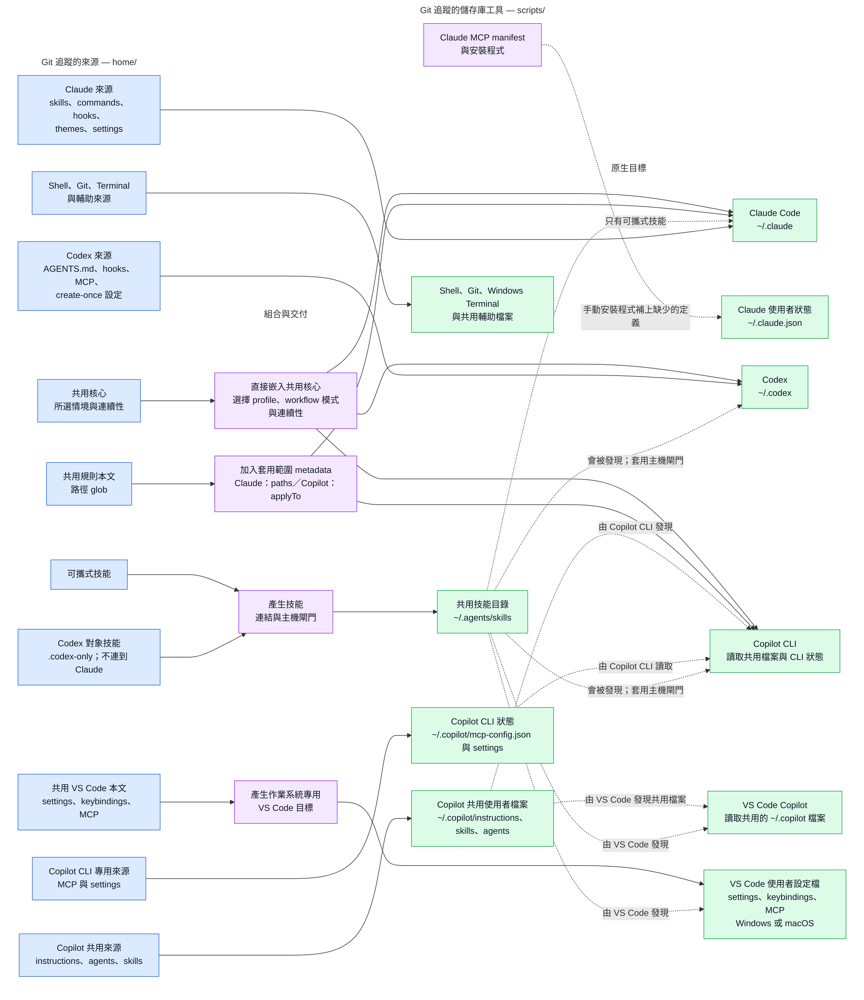
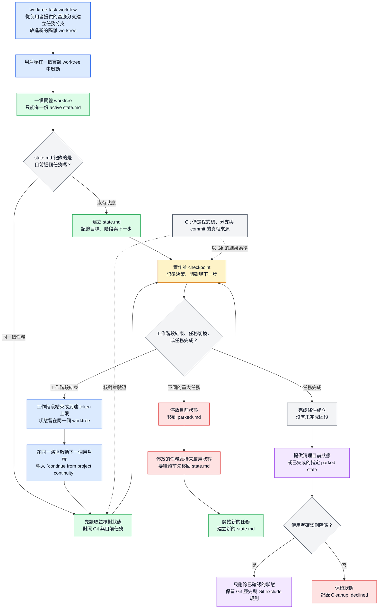
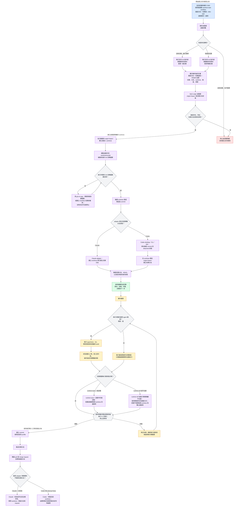
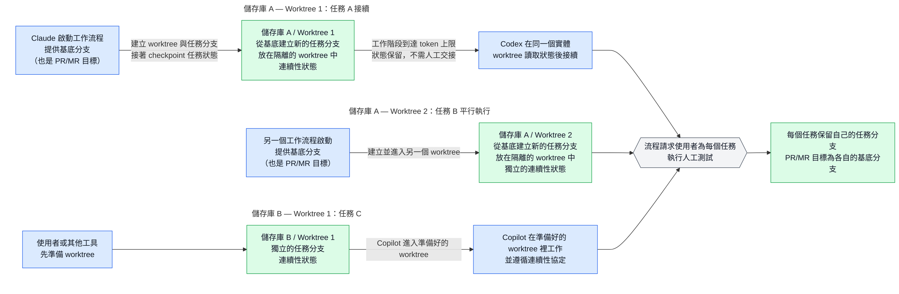

# 個人跨平台開發環境：Agentic 工作流程

[English](README.md) · [繁體中文](README.zh-TW.md)

> **快速摘要：** 這是一套跨平台的開發環境，內含一套代理式工作流程系統（**agentic workflow system**），支援
> 隔離的平行開發、跨用戶端 AI 交接、自動化驗證，以及可重現的設定。它由 [chezmoi](https://www.chezmoi.io/) 管理，
> 包含 Claude Code、Codex 與 GitHub Copilot 的 dotfiles 和 AI 用戶端整合，以及 VS Code、Zsh、Git、Windows
> Terminal 等開發設定。同一份 Git 追蹤的來源樹會產生各工具實際讀取的原生檔案。共用規則只保留一份本文，
> 不會變成三份各自飄移的副本；每個 worktree 的任務狀態能跨工作階段保留，讓平行任務彼此隔離；應用程式自己
> 管理的設定則留在本機。

```text
home/dot_bashrc  ──chezmoi apply──▶  ~/.bashrc
```

Git 追蹤只是基礎。重要的是這個儲存庫管理哪些內容、把哪些內容留給應用程式；chezmoi 合併負責的 key，
Git 排除私有狀態，pre-commit 則檢查這條界線。

## 這個儲存庫解決的問題

| 問題 | 儲存庫的解法 |
| --- | --- |
| Claude Code、Codex 與 Copilot 使用不同的指示檔案與套用範圍，AI 編碼指引很容易因此逐漸不一致。 | 共用 AI 指引只保留一份，專屬內容留在各用戶端的原生來源，再由 chezmoi 產生各用戶端需要的格式，並在 commit 前檢查 parity。 |
| 儲存庫管理的設定與應用程式偏好，可能都把整份檔案當成唯一來源，結果互相覆蓋。 | 管理 key，不管理整份檔案：深層合併儲存庫負責的 key，只有在檔案不存在時才建立預設值，其餘應用程式偏好留在本機。 |
| 工作階段可能在交接前結束；平行任務需要隔離的 worktree，才能各自保留檔案、分支與連續性狀態。 | Git 負責程式碼與分支狀態；每個 worktree 用一份由 Git 忽略的連續性檔案記錄交接脈絡，每個任務各自擁有目錄與分支。 |
| 同一個設定在不同作業系統上會放在不同路徑。 | 由同一份來源依條件產生各作業系統的目標，只寫出 Windows 或 macOS 會用到的路徑。 |
| 還原 checkout 後，可能仍缺少執行所需的工具與整合。 | 用 bootstrap 腳本、manifest、診斷工具，以及應用程式安裝後的第二輪處理，補齊支援工具與整合。 |

## 設定一台電腦

全新電腦或已有設定的電腦，都請使用[設定指南](./docs/setup.md)。指南涵蓋保留既有設定、安裝應用程式、
bootstrap、機器專用 profile 與驗證。電腦上已有設定時，套用任何東西前先檢閱 `chezmoi diff`。

## 架構：單一來源，原生輸出

Chezmoi 把 `home/` 下的檔案視為**來源狀態**：也就是你應該編輯並提交的理想設定。寫入家目錄的檔案
則是**目標檔案**：應用程式實際讀取的那一份。

儲存庫根目錄有一個 `.chezmoiroot` 檔案，指名 `home/` 就是這份來源狀態。這也是為什麼所有受管理的
檔案都放在 `home/` 底下，而套用這個儲存庫不會產生 `~/home/` 目錄。

來源檔名本身也有意義。`dot_` 會變成開頭的 `.`，`.tmpl` 會啟用 template 產生，而 `create_`、
`modify_` 與 `symlink_` 等前綴則決定 chezmoi 怎麼處理目標檔案。新增或重新命名來源檔案前，請先閱讀
[chezmoi 工作流程](./docs/chezmoi-workflow.md)。

Claude Code、Codex 與 GitHub Copilot 會從不同的原生檔案與套用範圍規則探索指示。下面的架構圖會說明
chezmoi 和手動執行的 Claude MCP 安裝程式，怎麼把可重用來源與用戶端專屬來源，產生各用戶端自己的原生輸出。

**圖：每一類受追蹤的來源，各自怎麼走到它的原生目標。** 實線箭頭代表 chezmoi 產生檔案；虛線箭頭代表連結、探索，
或手動執行 Claude MCP 安裝程式。每條虛線都標示了它的實際用途。

四張圖共用以下配色：藍色表示來源、角色、進入點與交接；紫色表示流程協調、adapter、發佈與清理；綠色表示狀態、worktree 與原生輸出；
琥珀色表示進行中的工作與驗證；灰色表示決策與 Git 權威來源；紅色表示受阻或停放的流程。



### 以原生功能優先的 workflow 委派

這套 workflow 負責協調契約，不會取代用戶端本身的功能。只要用戶端的原生功能能可靠地
滿足必要的不變條件，adapter 就應優先使用它。儲存庫自有的 fallback 只補上原生行為無法
表達或驗證的部分。

| 議題 | 優先使用的原生機制 | 本儲存庫仍負責的契約 |
| --- | --- | --- |
| 建立與管理 worktree | Claude `--worktree` 或 `EnterWorktree`；Codex desktop 的 Worktree 與 Handoff | workflow 的隔離檢查，以及各用戶端需要的 fallback。 |
| 選擇起始分支 | Codex desktop 的分支選擇；Claude 支援的 `baseRef` 或 PR／MR 輸入 | 驗證任意 `origin/<base>`，並一致地把它當成任務與 request 的基底。 |
| 建立並發佈任務分支 | 原生分支、commit、push 與 GitHub pull request 控制（只要符合任務需求） | 推導任務分支、保留選定的基底，避免分支或 request 目標漂移。 |
| 恢復工作階段 | Claude 的 resume 與 worktree 綁定；Codex 的對話／worktree Handoff | 可攜式的 `.project-continuity/state.md`，以及跨用戶端的 Git 核對。 |
| 佈建忽略檔案與環境 | `.worktreeinclude`，以及 Codex desktop 可用的 local-environment setup | 經過審查的 allowlist，以及 terminal、VS Code、CLI 與跨用戶端 fallback。 |
| 執行驗證 | Claude `/run`、`/verify`、hooks，或 Codex actions 與 hooks | 儲存庫的重點檢查、runtime 證據，以及使用者手動測試關卡。 |
| 隔離 runtime 資源 | 專案自行定義的 runtime 設定 | 選用的 descriptor 與每個 worktree 的 HTTP 連接埠配置；資料庫及其他服務仍由專案負責。 |
| 保留或移除 workflow | 用戶端原生 artifact 的 session／workflow 儲存功能 | 明確的來源 bundle archive、restore 與 delete 生命週期。 |
| 清理 | 由用戶端管理 worktree 時，使用其原生生命週期控制 | 保留分支的清理規則，以及 live target 必須另外審查後才能 `chezmoi apply`。 |

這項政策會依用戶端介面分別套用。Claude 可以原生建立與恢復 worktree，但它的 `baseRef`
設定無法表達所有指定名稱的既有分支；需要精確基底契約時，workflow 會改用 Git。Codex
desktop 現在提供原生的 worktree、setup、分支與發佈控制；workflow 仍支援 Codex CLI 與
IDE extension，並會驗證選定的 worktree 是否符合要求的基底。原生 setup 與驗證可以簡化
adapter，但不會配置每個 worktree 專用的連接埠，也不會提供可跨用戶端使用的狀態。

如果用戶端日後提供可靠滿足其中一項不變條件的原生功能，請移除或繞過對應的自訂機制，
不要同時維護兩套互相競爭的實作。

這項政策所依據的用戶端行為，請參考目前的 [Claude Code worktree 文件](https://code.claude.com/docs/en/worktrees)、
[Claude Code workflow 文件](https://code.claude.com/docs/en/workflows)、[Codex worktree 文件](https://learn.chatgpt.com/docs/environments/git-worktrees)，
以及 [Codex local-environment 文件](https://learn.chatgpt.com/docs/environments/local-environment)。

三個細節就能解釋大部分的結構：

- **共用指示會直接嵌入，不是 import。** 每個用戶端的原生指示檔都收到同一份本文。Codex 只收到永遠
  載入的核心，因為 Codex 既不支援 import，也沒有路徑範圍指示。
- **一個可攜式技能就是一份實體檔案。** 它放在 `home/dot_agents/skills/`，產生到 `~/.agents/skills`，
  Codex、Copilot 與 VS Code 都能原生找到。Claude Code 只從 `~/.claude/skills` 讀個人技能，所以改用
  個別 symlink 連到同一份檔案。`.codex-only` marker 則是擋住共用的那一份，不讓它被當初沒有要給的
  宿主自動叫用；真的需要自己版本的用戶端，會拿到一份原生副本，而不是 symlink。
- **VS Code 是編輯器宿主，不是第四個 Copilot。** 它的設定、keybindings 與 MCP 檔案使用作業系統專用的
  包裝器；Copilot 的指示、agent 與技能則放在各自宿主支援的位置。

### 為什麼有些內容共用，有些不共用

| 內容 | 表示方式 |
| --- | --- |
| 永遠載入的工作約定 | 一份共用本文，直接嵌入 Claude 的 `CLAUDE.md`、Codex 的 `AGENTS.md` 與 Copilot 指示。情境層與連續性指示由本機選擇器決定要不要組進來，所以同一份來源在個人電腦與公司電腦上會產生不同的工作約定。 |
| 路徑範圍規則 | `home/.chezmoidata.yaml` 中的一份本文與一個 glob，再由 Claude 與 Copilot 的薄型 frontmatter 包裝器產生。Codex 沒有對等的路徑範圍輸出。 |
| 可攜式技能 | `home/dot_agents/skills/` 下的一個實體技能目錄，只產生一份到共用探索目標，Claude 再透過 symlink 讀到同一份。`.codex-only` marker 搭配原生 metadata 則用來閘門一個以 Codex 為對象的技能：Codex 會隱式叫用它，Copilot 找得到但不能自動叫用，Claude 則不會有 symlink，因為它有自己的原生轉接層。 |
| 用戶端專屬技能、agent、命令與 MCP 檔案 | 放在相關用戶端的原生來源目錄中，絕不改寫成容易誤導的「工具中立」複本。 |
| VS Code 檔案 | `home/.chezmoitemplates/vscode/` 下的共用本文，再各自包裝一次，產生 Windows 與 macOS 使用者設定檔的目標。 |

`home/.chezmoitemplates/` 下的檔案是可重用的本文，不是目標檔案；本文通常要搭配用戶端或作業系統
包裝器才能產生。[AI 自訂指南](./docs/customization-support.md)把每一項自訂內容對應到負責它的來源
路徑，以及會讀到它的介面。

## 本機 profile 與連續性

Chezmoi 的本機設定中有兩個彼此獨立的輸入，以及一個 managed 模式選項，用來選擇產生出來的 AI profile；
這些值都不會被 commit：

```toml
[data]
ai_context = "company"        # personal 或 company
ai_continuity = "on"          # on 或 off
ai_harness = "managed"        # managed 或 native
```

| 選擇器 | 控制什麼 | 預設值與界線 |
| --- | --- | --- |
| `ai_context` | personal 或 company 情境層、它的產出語言預設值，以及應用程式與專案儲存庫的預設註解語言。 | 未設定時等同 `personal`；其他值會讓產生失敗。 |
| `ai_continuity` | 在 managed 模式中是否載入連續性指引並啟用生命週期回報。 | 未設定時等同 `on`；其他值會讓產生失敗。native 模式會保留這個值，但不會套用它。 |
| `ai_harness` | `managed` 啟用完整的自動化 harness；`native` 只保留低介入的共用 AI 層。 | 未設定時等同 `managed`；其他值會讓產生失敗。`ai_workflow` 只作為舊設定的相容別名。 |

組合方式是：

```text
共用基準 + personal 或 company 情境
ai_harness = managed 時啟用 managed harness 行為
managed 且 ai_continuity = on 時載入連續性指引並啟用生命週期回報
```

`ai_continuity` 儲存是否偏好連續性；只有在它是 `on` 且 `ai_harness = "managed"` 時，才會實際載入連續性指引並啟用
自動生命週期回報。`managed` 也會註冊通知與 Claude 的 worktree 啟動檢查。`native` 保留共用指引、可重複使用的技能、
statusline、輕量通知、傳遞用包裝器與私有檔案保護，但不載入連續性指引，也不註冊連續性或 worktree 生命週期 hook。切回
`managed` 時，原本儲存的連續性偏好仍可重新生效。Shell、Git、VS Code 與 Windows Terminal 設定不受這個選擇器控制；workflow
技能在兩種模式中都仍可明確叫用。會改變狀態的 workflow 技能不會自動啟動；managed 的生命週期 hook 只會回報事件，
不會自動建立 worktree 或修改來源狀態。

改動選擇器只影響之後產生的設定與之後啟動的工作階段；正在執行中的工作階段仍維持啟動時的情境。
儲存庫指示與使用者直接下的指示仍然優先，而且這個儲存庫的根目錄 `AGENTS.md` 刻意規定：在這裡工作
時一律使用 `personal` 情境，就算電腦設定成 `company` 也一樣。

產出語言預設值的適用範圍很窄。它會影響 commit 描述與內文、worktree 的 commit 與 request 文字，
以及受管理的 VS Code Copilot commit message 指引。它不會翻譯分支名稱、路徑、命令、使用者層級的
dotfiles，也不會翻譯這份 README。明確傳入 `en` 或 `zhtw` 可以覆寫預設值。

### 專案連續性

連續性只屬於一個實體工作樹，而每個工作樹最多只有一份有效狀態：

- `.project-continuity/state.md` 記錄目標、階段、下一步、阻礙、假設與驗證狀態——它記的是工作停在
  哪裡、為什麼停，不是專案文件。
- `managed` 且連續性開啟時，Claude Code 與 Codex 會回報現有狀態，並指出分支或 `HEAD` 的落差。`native`
  模式仍保留連續性技能供明確叫用；Copilot 可以遵循同一套協定，只是沒有自動 hook。
- Git 仍然是依據。連續性提供的是脈絡與最後已知狀態，不能用來證明某件事已經完成。
- 狀態檔由 Git 忽略，兼顧隱私與方便。它是本機交接檔，不是加密保險庫，所以這套流程明文禁止把憑證
  放進去。
- 開始另一個任務前，未完成的狀態要先停放到 `.project-continuity/parked/`，這樣一份交接紀錄才不會
  覆蓋掉另一份。

連續性狀態屬於實體目錄，而 worktree task workflow 會建立這個目錄與任務分支。下面的生命週期圖說明兩套流程
怎麼接在一起。

**圖：專案連續性的生命週期，以及它和隔離 worktree 的關係。**



worktree task workflow 負責提供隔離的實體目錄；專案連續性則把未完成的任務狀態留在那個目錄中，不管下一次是由哪個
支援的用戶端接手。工作階段交接會保留 `state.md`；切換任務前會先停放這份檔案；任務完成後，只有使用者確認才會進入
清理。Git 仍然是程式碼與分支的權威來源，所以連續性不會取代 commit、分支或 pull request。

例如，Codex 工作階段到達 token 上限而結束後，請在同一個 worktree 開啟新的 Codex 工作階段，輸入
`continue from project continuity`。Codex 會讀取 `.project-continuity/state.md`，從記錄的下一步繼續。

把 `ai_continuity` 關掉後，永遠載入的連續性指引與連續性 hook 會移除，但 managed 模式的通知與 Claude worktree 啟動檢查
仍然保留。`ai_harness = "native"` 會移除連續性與 worktree 生命週期 hook 及連續性指引，但保留 statusline、輕量通知、共用
指引、可重複使用的技能、包裝器與保護機制。切換 harness 模式可能需要 Codex 重新接受 `/hooks`，因為 hook 信任也包含每個
項目的內容雜湊。明確叫用的 worktree 與連續性技能在所有組合中都保留。

### 平行處理多個任務又不會弄丟狀態

連續性的範圍是目錄，所以要同時進行多個任務，靠的就是隔離。`worktree-task-workflow` 技能會把一個
任務放進專屬的 worktree，從頭帶到尾。

啟動位置也很重要。請從儲存庫目前的工作目錄（CWD）啟動流程；這個目錄可以是主要 checkout，也可以是已連結的
worktree。CWD 用來辨識儲存庫、檢查 worktree 註冊資訊，以及從啟動流程的 worktree 讀取 `.worktreeinclude` 來佈建檔案。
建立新任務時，流程不會在主要 checkout 中編輯：若從主要 checkout 啟動，流程只會在那裡解析並驗證請求，接著把用戶端交給
或佈建到隔離 worktree。之後用戶端必須實際在那個路徑中執行；只改變 shell 的 CWD 不會移動現有的 Codex 對話。從這一步開始，
任務分支、連續性狀態、編輯、檢查與發佈都屬於隔離 worktree。

這套流程從使用者啟動 `worktree-task-workflow` 開始，啟動時提供基底分支、任務（或要求推導任務）、參考素材與
選項。流程會從 `origin/<base>` 建立新的 worktree，透過 `.worktreeinclude` 佈建核准的 Git 忽略檔案，再從同一個
基底 commit 建立任務分支。最後的 pull 或 merge request 也會以同一個基底分支為目標。

這套流程是明確叫用的選項，適用於實質或需要隔離的工作，不是每項任務都必須經過的入口。簡單、單一且不需要平行隔離的修改，
可以留在目前有效的 worktree；只有在需要隔離、跨工作階段交接、受控驗證或發佈時，才選用這套流程。

Worktree 隔離涵蓋來源與 Git 狀態，但不會隔離執行中的服務或其連接埠。需要平行測試應用程式時，請在使用中的儲存庫提供追蹤中的
`.worktree-runtime.json` 描述檔後，以 `runtime=auto` 明確叫用這套流程。這個 helper 會為每個實體 worktree 保留偏好的連接埠，
在伺服器執行期間取得 lease，並回報固定連接埠或其他無法支援隔離的執行環境相依項目。這保留了我們約定的設計邊界：只有在明確選用
流程時才提供強而有力的執行環境保證，不會強迫每項任務或每個專案都套用僵化的 harness。預設值是 `runtime=off`，不會啟動伺服器。
V1 只處理一個 HTTP 開發程序及其連接埠；描述檔可以標示資料庫、cache、queue、Docker 服務與外部服務，但 helper 只會回報這些分類，
不會替它們建立隔離環境。連接埠配置會留在 worktree 與 Git 之外的使用者快取中，因此 `chezmoi apply` 不會啟動專案伺服器，也不會還原
runtime 配置狀態。

`worktree-task-workflow` 會把一項實質的開發任務轉成可重複的隔離流程：先驗證起始分支，建立專用 worktree 與任務分支，讓任務脈絡
能跨 AI 工作階段保留，執行自動化驗證，請求使用者進行人工測試，再把變更發佈到正確的基底分支。這能降低分支或基底選錯、脈絡遺失、
漏做驗證、request 目標不一致，以及同時處理多個任務或 AI 用戶端時的手動設定負擔。

**圖：一個新任務的生命週期，包含素材檢閱、worktree 佈建、選用的執行環境隔離、agent 自動驗證與使用者人工測試關卡。** 圖中標出
Claude 與 Codex 的分支流程；worktree 路徑與清理方式也會依 adapter 而不同。



這套流程讓每個任務都有自己的目錄、任務分支與連續性檔案。使用者指定的基底分支同時是任務分支的建立起點，
也是最後 pull 或 merge request 的目標。流程會先解析啟動參數與提供的素材，顯示解析後的計畫，再 fetch `origin`，
確認基底分支有效後才建立任何東西。

worktree 階段會依 adapter 採用不同的 Git 流程：

- Claude adapter 用 `git wt-add` 從 `origin/<base>` 一次建立任務分支與 worktree，再用 `EnterWorktree` 進入該路徑。
- Codex desktop 透過 Handoff 建立 detached worktree 並複製 `.worktreeinclude`。Codex CLI 與 IDE extension 會先佈建
  detached worktree、回報路徑，再讓 Codex 在該路徑建立或接續工作階段，最後從基底 commit 建立任務分支。

對 terminal Git 來說，先建立 worktree 再讀取 `.worktreeinclude` 是刻意的順序：`git wt-add` 先建立目的地，接著才讀取
追蹤中的 manifest 並複製核准的 Git 忽略檔案。如果缺少必要檔案，流程會使用 `git wt-copy`、請使用者放置指定檔案，或
提供 `worktree-manifest` 技能作為範圍明確的任務；沒有安全的處理方式就會停止。

工作階段因為 token 上限而結束時，下一個用戶端可以進入同一路徑，讀取記錄的目標、決策、素材、阻礙與下一步，
不需要手動整理交接文件。`agent-test=true` 會執行 typecheck、lint、聚焦測試、有意義的 build，以及視覺工作可用時的
瀏覽器或執行期驗證；`agent-test=false` 仍會執行最低限度的合理檢查。任務需要執行應用程式時，流程會先判斷是否有明確指定的 runtime 路徑：
`runtime=auto` 會使用追蹤中的描述檔並驗證每個 worktree 的連接埠；`runtime=off` 或執行環境隔離不支援時，會使用專案原本的啟動方式，
並回報不保證每個 worktree 有獨立連接埠。指定的瀏覽器流程則驗證特定 UI 操作。兩者都不取代人工測試。

人工測試關卡會提供 worktree 絕對路徑、啟動命令、路由、前置條件、操作順序與預期結果，接著停止並等待。只有使用者
回報人工測試通過後，流程才會建立 commit、推送任務分支，並開啟以基底分支為目標的 request。Claude 會在通過安全檢查
後移除 worktree；Codex 則把目前 worktree 留給應用程式或使用者處理。兩個 adapter 都不會刪除任務分支。

素材處理、分支命名、缺少檔案時的 manifest、瀏覽器 driver 的限制，以及保留分支的清理規則，都寫在
[worktree 佈建指南](./docs/worktree-provisioning.md#what-the-task-workflow-does-at-each-step)。

專案素材也是工作流程的一部分。建立 worktree 前，流程會先閱讀提供的規格、交接筆記、參考文件與測試
輸入，分類後把路徑記進連續性狀態。需要歸檔時，需要長期保留的參考資料放在
`~/Documents/reference-docs/{repo}/`，大型或需要跨 worktree 共用的人工測試輸入放在
`~/Documents/test-files/{repo}/`，沒有正式歸屬位置的 agent 交接摘要放在
`~/Documents/handoff/{repo}/`。目前任務狀態留在 worktree 內由 Git 忽略的
`.project-continuity/state.md`；可長期維護的測試程序與 fixture 留在儲存庫裡。有正式歸屬位置的產出，
例如 MR 說明，就留在原本的地方，不另外複製。

**圖：儲存庫 A 用多個 worktree 平行執行任務，其中一個任務透過連續性狀態跨用戶端接續。**



這張圖的核心是任務 A：Claude 啟動工作流程時提供基底分支；這個分支既是任務分支的建立起點，也是之後
PR/MR 的目標分支。流程會建立並進入隔離 worktree，接著把任務狀態 checkpoint 在其中。AI 工作階段到達 token
上限後，Codex 進入同一個實體路徑並讀取原本的連續性狀態。任務 B 是同一個儲存庫中的另一個工作流程啟動，
有自己的基底分支、任務分支、worktree 與狀態。任務 C 表示由使用者或其他工具先準備好 worktree，Copilot
進入後遵循連續性協定；目前沒有自動建立 worktree 的 Copilot adapter。
Git 仍然是程式碼、分支與 commit 的真相來源；連續性只補上 Git 記不住的目標、決策、阻礙、素材與下一步。

工作階段可以丟棄，但 worktree、分支與連續性狀態會保留。Claude 通過安全檢查後可以移除由它管理的 worktree；
Codex 則把目前的 worktree 留給應用程式或使用者處理。無論哪一種情況，任務分支與 PR/MR 都會保留供檢閱，
清理不會刪除任務分支。Copilot 進入準備好的 worktree 後可以遵循相同的連續性協定，但這個儲存庫目前只有
Claude Code 與 Codex 的自動 worktree 轉接層。

人工測試關卡就是無法平行化的那一段。agent 可以散開來跑，驗證最後仍要匯聚到使用者的人工測試。

這個技能有 Claude 與 Codex 兩個轉接層，因為兩者提供的隔離任務路徑不同：Claude 會建立並進入它管理的
worktree；Codex 會建立或進入 detached worktree，再從選定的基底分支建立任務分支。剛建立的 worktree 不會
帶任何被忽略的檔案，所以由 `worktree-manifest` 技能撰寫核准過的 `.worktreeinclude`，再由 `git wt-add` 依此
佈建。[worktree 佈建指南](./docs/worktree-provisioning.md)說明兩個 adapter 與 Copilot 的獨立協定。

這個儲存庫本身是例外：它固定留在主要 checkout，因為 chezmoi 的來源解析綁在那一個工作樹上。

## 還管理了哪些東西

| 介面 | 代表性內容 |
| --- | --- |
| Claude Code | 共用 `CLAUDE.md`、路徑範圍規則、連結過去的技能、Claude 專屬技能與命令、hook、主題定義、跨平台狀態列與通知，以及選定的持久設定。 |
| Codex | 共用 `AGENTS.md`、生命週期 hook、共用與受主機閘門管理的技能，以及 create-once 設定預設值。 |
| GitHub Copilot CLI | 共用指示、Copilot 專屬 agent 與技能、設定，以及使用者 MCP 宣告。 |
| VS Code | Windows 與 macOS 的使用者設定、keybindings、MCP 設定、擴充功能清單，以及支援的 Copilot 自訂內容。 |
| Shell 與 Git | Bash、Zsh、profile 啟動設定、延遲載入的 `nvm`、Git 身分與別名，以及 `git wt-add`／`git wt-copy` worktree 命令。 |
| Windows Terminal | 持久的字型與輸入行為，加上完整的 actions 與 keybindings 陣列；自動產生的機器專屬設定檔仍由應用程式管理。 |
| 儲存庫工具 | Bootstrap 腳本、Claude MCP 安裝程式、MCP、擴充功能與 workflow manifest、診斷工具、跨平台輔助程式、workflow archive 與 deletion 工具、回歸測試，以及架構決策紀錄。 |

可攜式技能庫涵蓋無障礙檢視、瀏覽器協作、Word／PowerPoint／Excel 與 PDF 處理、commit 慣例與 commit
撰寫、自然的繁體中文、prompt 最佳化、技術寫作、專案連續性、worktree manifest、worktree 任務工作流程，
以及 `workflow-archive`／`workflow-restore`／`workflow-delete`。如果某個工作流程依賴特定用戶端的機制，就會有對應的用戶端專屬技能放在旁邊。Copilot 另外
有儲存庫架構、前端效能與資安檢視三個 agent。

以上只是代表性清單。新的應用程式、dotfiles、整合與 AI 用戶端轉接層，都沿用同一套「來源產生為原生
目標」的模式。

開發體驗層包含一個跨平台的 Claude 狀態列：


狀態列會顯示模型與努力程度、工作階段名稱、工作目錄、Git 分支與檔案狀態、context 使用量，以及**五小時與
七天用量視窗和各自的重置時間**。Bash 與 PowerShell 兩份實作由 pre-commit 對等檢查，並計算中文與 emoji 的
顯示寬度，讓版面在狹窄的終端機中仍然容易閱讀。

## 權責界線

這個儲存庫不打算管理應用程式寫入的每一個位元組，而是採用剛好夠用的最小權責範圍：

Claude Code 的 `/config` 命令、Windows Terminal 與 Codex 都會把應用程式自己管理的選擇寫進這個儲存庫
也會處理的檔案。所以這裡管理的是 key，不是整份檔案：modify template 深層合併負責的 key，create-once
來源只在檔案不存在時提供預設值，只有無法合理只合併一部分的陣列才整個宣告。下面的表格列出每個目標
檔案的權責界線。

| 目標 | 儲存庫負責 | 應用程式或使用者負責 |
| --- | --- | --- |
| Claude `settings.json` | 持久的環境變數、hook、狀態列與更新頻道，由 modify template 深層合併。 | 模型、努力程度、選用中的主題、權限、plugin 啟用狀態、專案狀態，以及之後新增的 key。 |
| Codex `config.toml` | 檔案還不存在的電腦上的預設值。 | 現有的信任、執行期、marketplace 與工作階段狀態。`create_` 屬性可避免整份被取代。 |
| Windows Terminal `settings.json` | 選定的持久設定，加上完整的 `actions` 與 `keybindings` 陣列。 | 自動產生的設定檔與其他未列名的設定。被宣告的陣列會在 apply 時整個取代。 |
| VS Code 使用者檔案 | 透過作業系統專用包裝器產生的設定、keybindings 與 MCP 來源。 | Workspace 儲存、驗證資訊、擴充功能快取與執行期資料。 |
| Claude 使用者 MCP 狀態 | 不含機密的宣告，透過 manifest 與「只補缺少項目」的安裝程式處理。 | 驗證資訊與 `~/.claude.json` 的其餘部分，那裡同時存放應用程式狀態。 |

第二層防護是避免私有檔案被誤 commit。全域 Git 排除檔透過 `core.excludesFile` 掛上，在每個儲存庫中
保護這幾個明確指定的位置：

```text
**/.claude/settings.local.json
**/CLAUDE.local.md
**/AGENTS.override.md
/.project-continuity/
```

共用的 `AGENTS.md`、`CLAUDE.md`、`.github/copilot-instructions.md` 與其他儲存庫指示檔仍然可以追蹤。
這套忽略規則防的是誤追蹤；它不會把檔案複製進 worktree，也不會加密任何東西。

這個全域檔案只是兩層防護的其中一層，這也是為什麼連續性在兩個地方都出現。全域檔案涵蓋這台電腦上的
每一個儲存庫；而在單一儲存庫裡，連續性技能還會把 `/.project-continuity/` 寫進 `.git/info/exclude`，
因為那個檔案放在 Git 的共用目錄，所以這一條設定就同時涵蓋主要 checkout 與每一個 worktree，包括之後
才建立的。

憑證絕不 commit。MCP 設定裡放的是端點，以及在支援的情況下放 `${input:figma-api-key}` 或
`${GITHUB_MCP_TOKEN}` 這類佔位符——不是實際的值。每個用戶端都在本機登入，並把工作階段、log、快取、
已安裝的 plugin 與金鑰都留在 `home/` 之外。

## 日常怎麼用

編輯來源狀態、用 `chezmoi diff` 預覽、只套用你檢閱過的內容，然後提交來源變更。動手前一定要先確認
chezmoi 設定中的來源就是這個 checkout：chezmoi 命令用的是它設定中的來源目錄，跟你當下在哪個目錄
無關，所以沒先確認就 `apply`，有可能把另一個 clone 的內容蓋到這台電腦的設定上。完整命令、`dotf`
系列 Shell 別名，以及 `bash scripts/dev-env doctor`，都寫在
[chezmoi 工作流程指南](./docs/chezmoi-workflow.md#daily-commands)。

這個儲存庫對編碼助理也是自我說明的。根目錄的 [`AGENTS.md`](./AGENTS.md) 告訴 Codex 與 Copilot 怎麼
找到真正的來源、怎麼保留由應用程式管理的狀態，以及怎麼把編輯、套用、提交與驗證分開；根目錄的
[`CLAUDE.md`](./CLAUDE.md) 則把同一份指引匯入給 Claude Code。你可以直接用想要的結果去問：

- 「我改了實際的 `.bashrc`，幫我把它保存回來源狀態。」
- 「新增一條 Claude Code 與 Copilot 共用的規則，並說明 Codex 能支援到什麼程度。」
- 「設定一個 VS Code 設定值，顯示 diff，然後只套用這一項檢閱過的變更。」

## 驗證與回歸測試涵蓋範圍

pre-commit hook 會把 staged 的來源產生到暫存目錄——絕不寫進家目錄——並檢查：

- chezmoi 來源身分，避免在指向另一個 clone 的情況下 commit；
- 這次 commit 會包含的每一條路徑，因為 Git 提交的是 index 而不是某個工作階段 stage 的那些路徑，
  而這個資料夾的 index 是所有在其中運作的行程共用的；
- 檔名屬性安全性與技能檔案數量對等，避免 chezmoi 的檔名轉換悄悄弄丟檔案；
- Claude 共用技能的 symlink，以及 `.codex-only` 技能的 Codex 主機閘門；
- Claude 與 Copilot 產生出來的共用規則本文逐位元組相同；
- Codex 產生出來的 `AGENTS.md` 沒有 YAML frontmatter；
- Bash 與 PowerShell 兩份狀態列實作在任一份變動時仍然一致；以及
- 每一個相對路徑的 Markdown 連結：它指的檔案要真的存在，帶 `#fragment` 時也要對得到真正存在的
  標題。這兩種失效都不會有任何徵兆，連結照樣顯示，要等讀者點下去才會發現。

以下的長期測試在對應的受保護行為變動時，手動執行：

| 變更 | 測試 |
| --- | --- |
| Windows worktree 實作 | `powershell.exe -NoProfile -ExecutionPolicy Bypass -File scripts/tests/test-git-worktree-provision.ps1` |
| macOS worktree 實作 | `bash scripts/tests/test-git-worktree-provision.sh` |
| 共用的 worktree 契約或安全界線 | 兩套 worktree 佈建測試都要跑。 |
| 專案連續性的生命週期或復原契約 | `bash scripts/tests/test-project-continuity-hook.sh` |
| AI profile 選擇器、組合方式、語言預設值或連續性開關 | `bash scripts/tests/test-ai-configuration-profiles.sh` |
| workflow archive／restore／delete 契約 | `bash scripts/tests/test-workflow-archive.sh` |
| Worktree runtime descriptor、配置與連接埠 lease | `python scripts/tests/test-worktree-runtime.py -v` |

連指示本身也有測試。`scripts/tests/continuity-fixtures/` 收了成對的 prompt 與預期行為，針對的是
連續性最容易處理錯的情境——狀態還在的時候突然冒出一個無關問題、實質換了另一個任務、使用者明確
放棄、分支落差、任務其實已經完成、只有計畫的冷啟動、未經確認的資料來源歸屬，以及超出搜尋範圍的
負面結論、只有 Artifact 的交接，以及 Claude 與 Codex 私有專案指示在用戶端之間不會自動互通的雙向界線。
每個 fixture 都透過 `setup-case.sh` 在拋棄式儲存庫中建立。那裡的 `state.md` 是刻意做成跟真的一模一樣的，所以絕對不要
對那個目錄底下找到的 `state.md` 採取任何行動。

## 儲存庫結構

```text
home/                              chezmoi 來源狀態
  .chezmoidata.yaml                共用規則 glob
  .chezmoitemplates/               共用本文與跨作業系統資料
  dot_agents/skills/               可攜式與受主機閘門管理的技能
  dot_claude/                      Claude Code 檔案與轉接層
  dot_codex/                       Codex 檔案與 create-once 設定
  dot_copilot/                     Copilot CLI 檔案、agent 與技能
  AppData/ · Library/              Windows 與 macOS 的 VS Code 目標
  dot_bashrc · dot_zshrc.tmpl      Shell 啟動檔
  dot_gitconfig.tmpl               Git 身分、別名與全域排除檔連結
  dot_config/git/ignore            個人 AI 與連續性排除規則
  dot_local/share/                 worktree 佈建、runtime 與通知輔助程式

scripts/bootstrap/                 手動執行的新電腦設定
scripts/install/                   Claude MCP 安裝程式
scripts/manifests/                 MCP、VS Code 擴充功能與 workflow 宣告
scripts/workflows/                 儲存庫 workflow archive 與 deletion 工具
scripts/diagnostics/               doctor、設定使用狀況與設定落差報告
scripts/tests/                     profile、連續性、worktree 與 runtime 測試
scripts/git-hooks/                 pre-commit 與 Markdown 連結驗證
archives/workflows/                受 Git 追蹤的可重複使用 workflow archive
docs/                              設定、工作流程、自訂與 ADR 指南
```

## 接下來要去哪裡

| 我想要… | 請看 |
| --- | --- |
| 新增、修改或移除一般受管理的檔案，或查日常命令 | [docs/chezmoi-workflow.md](./docs/chezmoi-workflow.md) |
| 新增 AI 指示、技能、agent、prompt、MCP 伺服器或 plugin | [docs/customization-support.md](./docs/customization-support.md) |
| 查某一項自訂內容是哪個用戶端介面會讀到 | [支援對照表](./docs/customization-support.md#what-the-support-table-answers) |
| 執行隔離任務，或在 worktree 中佈建被忽略的本機檔案 | [docs/worktree-provisioning.md](./docs/worktree-provisioning.md) |
| 在不同 worktree 中執行平行應用程式實例 | [docs/worktree-runtime.md](./docs/worktree-runtime.md) |
| Archive、restore 或 delete 可重複使用的 workflow | [docs/workflow-archives.md](./docs/workflow-archives.md) |
| 了解儲存庫為什麼採用這種結構 | [docs/decisions/README.md](./docs/decisions/README.md) |
| 在移除某條規則前先了解它為什麼存在 | [docs/rule-rationale.md](./docs/rule-rationale.md) |
| 讓編碼助理安全地在這個儲存庫裡工作 | [AGENTS.md](./AGENTS.md) |

這裡每一個結構上的選擇都寫下了理由。決策紀錄說明了為什麼操作程序與決策分開存放、為什麼共用內容
採用薄型包裝器、為什麼 Claude 設定是按 key 合併而不是整份取代、為什麼工作樹固定在 `~/dotfiles`、
為什麼 Codex 專屬技能用主機閘門而不是用目錄隔離、為什麼 workflow preservation 先做有界探索，再把明確 inventory 放在
作用中的來源與探索路徑之外，以及為什麼整個工作樹統一成 LF。每份紀錄都寫明了
什麼樣的變化該重新考慮這個決定，讓之後接手的人分得出哪些是刻意的限制、哪些只是歷史遺留。

探索路徑、frontmatter key、hook payload 與 worktree 行為都會隨上游版本改變。變更用戶端專屬的路徑或
key 之前，請先對照最新的
[chezmoi](https://www.chezmoi.io/reference/source-state-attributes/)、
[Claude Code](https://code.claude.com/docs/en/overview)、
[Codex](https://learn.chatgpt.com/docs/agent-configuration/agents-md) 與
[VS Code agent 自訂](https://code.visualstudio.com/docs/agent-customization/overview)官方文件確認。
