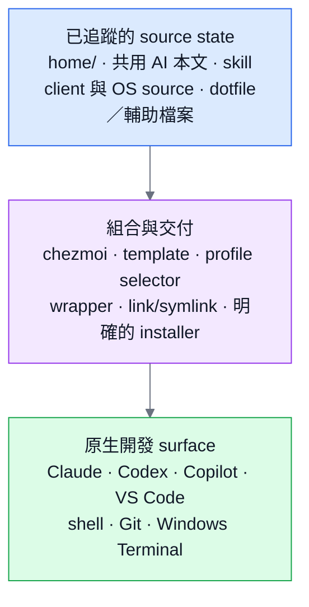
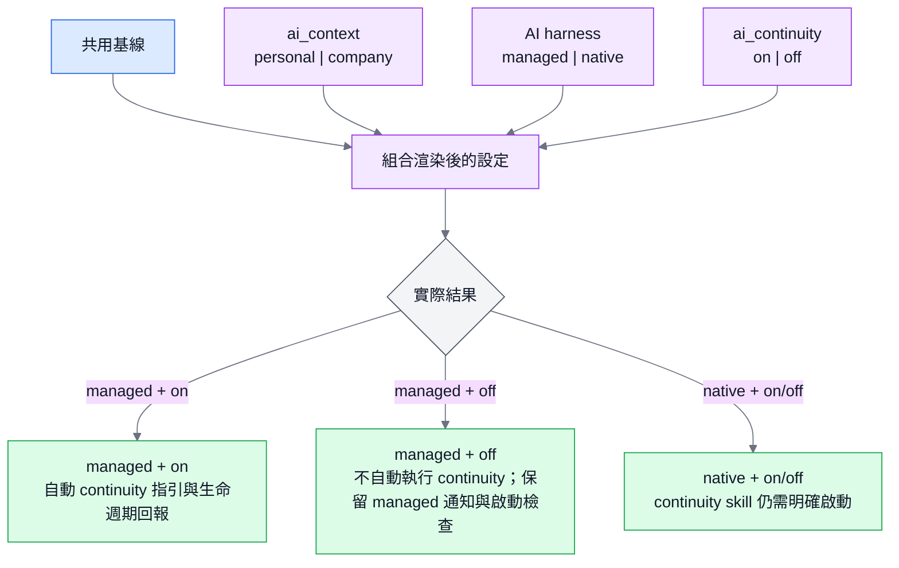
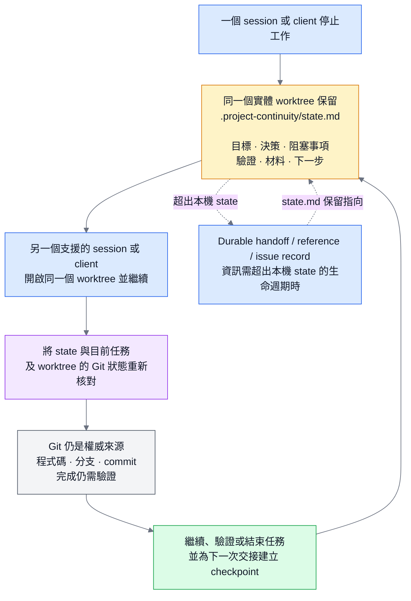
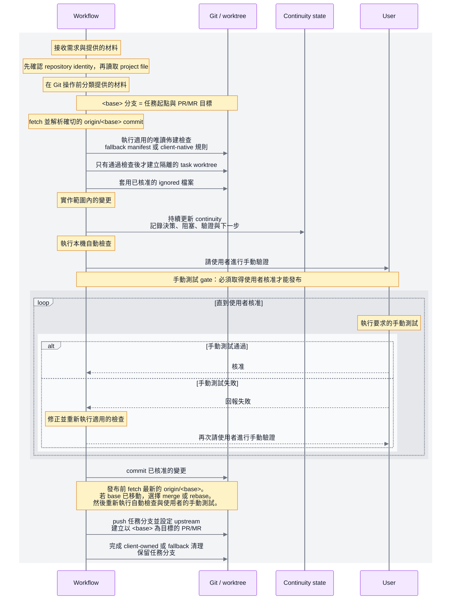

# 跨平台個人開發環境與代理式工作流程

[English](README.md) · [繁體中文](README.zh-TW.md)

我每天都用這個儲存庫作為開發環境的單一來源，將個人 dotfiles 與 AI 工具集中在同一個 Git 儲存庫中。共用的 AI 指示與可重用的工作流程可以定義一次，再交付給 Claude Code、Codex 與 GitHub Copilot；只屬於單一 client 的行為則留在該 client 自己的範圍內。這讓我可以更精確地控制各 client 的行為，不必維護多份副本，也不用擔心它們彼此漂移。儲存庫也只管理我明確選擇由它負責的持久設定；容易變動的偏好、驗證資訊、session state 與其他由應用程式管理的資料則留在本機。

Git 內建的 worktree 支援已經能提供良好的程式碼隔離；Claude Code 等 AI client 也能透過原生的 worktree 建立與生命週期支援，進一步利用這層隔離。不過，當多個 AI 輔助任務需要可靠地平行執行時，仍會遇到幾個問題：新的 worktree 可能缺少被 Git 忽略的本機檔案，多個同時執行的應用程式可能搶用同一個 runtime port，而 Git 無法記錄的任務脈絡可能仍綁在特定 session 或 client 上。

我的工作流程補上這些缺口：提供每個任務需要且已核准的本機檔案；當專案定義了執行方式時，為平行 worktree 分配不同 runtime port；並保留每個 worktree 的 continuity 紀錄。它刻意將程式碼狀態與任務狀態分開：Git 仍是目前程式碼、分支與 commit 的權威來源；continuity 紀錄則保留 Git 無法表達的任務脈絡——任務要完成什麼、為什麼做出這些決定、哪些事情被阻塞或已驗證、哪些相關材料與參考資料是這項工作的一部分，以及下一步要做什麼。因為這份紀錄屬於任務，而不是某一次對話，同一個 worktree 可以在另一個 session 或支援的 AI client 中重新開啟，簡單輸入 `continue` 就能接手。本機自動檢查與明確的使用者核准會形成兩道獨立的 gate，通過後才發布分支供 review。

[Chezmoi](https://www.chezmoi.io/) 會將受管理的 source 渲染成各支援工具與作業系統所期待的原生檔案。設定層和工作流程層搭配運作，讓 AI client 能在定義好的界線內工作；Git、驗證與明確核准仍然是權威依據。

**快速導覽：**

- [實際使用](#實際使用)
- [系統總覽](#系統總覽)
- [專案連續性](#專案連續性)
- [任務生命週期與隔離 worktree](#任務生命週期與隔離-worktree)
- [Profile 與 AI harness 模式](#profile-與-ai-harness-模式)
- [儲存庫結構](#儲存庫結構)

> ⚠️ **個人設定提醒：** 這個儲存庫包含我的個人偏好，不是通用的預設設定。既有機器請先查看
> `chezmoi diff`，只套用你確定要變更的 target。只有在覆寫這些個人設定沒有問題的機器上，才適合
> 大範圍套用這個儲存庫。

## 這個儲存庫提供什麼

| 核心能力 | 結果 |
| --- | --- |
| 單一來源、原生目標 | 共用的 AI 指示與可重用的 AI skill 都以單一來源內容維護；薄包裝保留各 client 原生的 discovery path 與 scope 規則。 |
| 以 profile 組合設定，不重複維護整套設定 | 本機 selector 將 personal 或 company context 與 managed 或 native AI harness 組合，並另外控制 continuity 偏好。 |
| 跨 session 與 client 的連續性 | 一個 `.project-continuity/state.md` 跟著一個實體 worktree 保存，讓其他支援的 session 從相同的目標、決策、阻塞事項、材料、驗證狀態與下一步繼續工作。 |
| 隔離且可檢視的任務 | 明確啟動的工作流程會固定 base，建立任務 worktree 與分支，只配置已核准的 ignored 本機檔案，先執行本機自動檢查，再請使用者進行獨立的手動測試，通過後才發布，而且不會刪除分支。 |

權責界線與驗證支援這四項核心能力，是貫穿整個系統的保證，不是另外新增的第五項能力。

這個儲存庫也會把應用程式擁有的偏好留在本機，支援 Windows 與 macOS 路徑，並在
[架構決策紀錄](./docs/decisions/README.md)中記錄重要的設計取捨。

## 實際使用

較大型的任務可以直接用自然語言 prompt 開始；如果自動化流程或後續追蹤需要明確記錄每個欄位，
也可以使用完整格式：

`$worktree-task-workflow "Implement the water-fee frontend changes from the attached specification, based on origin/feat/water-fee."`

`$worktree-task-workflow <base-branch> "<task>" [materials...]`

Prompt intake 會先解析任務、提供的材料與已驗證的 MR/PR target，再進入同一套工作流程：

`開始任務 → 建立隔離 → 記錄脈絡 → 實作 → 驗證 → 手動核准 → 發布供 review`

工作流程會把任務目錄、分支與交接脈絡綁在一起；在自動檢查通過並取得使用者明確核准前，不會發布變更。詳細契約會解析精確的 base 與 MR/PR target，從 `.worktreeinclude` 或 client 原生機制補上任務缺少的已核准 ignored 檔案；如果專案提供 descriptor 並選擇 `runtime=auto`，流程還會為每個 worktree 配置 port 並執行 health check。

以提問、評估或閱讀材料為主的 prompt 會先停在唯讀的規劃階段；要建立 worktree，請明確說 `proceed` 或使用 `phase=execute`。它不會複製 tracked configuration 或 external secret。

## 系統總覽

`home/` 是這個儲存庫用來管理 dotfiles 與 AI 設定的 chezmoi source state。[Chezmoi](https://www.chezmoi.io/)
會把這些 source render 成應用程式實際讀取的原生 target。`scripts/` 與 `docs/` 同時支援設定層與工作流程層，提供
bootstrap、診斷、安裝工具、測試與決策紀錄。

下圖只呈現設定層：tracked source state 經過組合與原生交付，流向各工具實際讀取的 surface。
專案連續性與任務執行會在下文分別說明。完整的 client-to-surface 對應請看
[customization support guide](./docs/customization-support.md)。

`home/` 同時包含一般的 chezmoi source file 與 template。`.chezmoitemplates/` 中的可重用內容
會由各 client 的薄 wrapper 組合；可攜式 skill 維持單一共用來源，必要時再透過 link 或 symlink
交付到 client 的原生 discovery 路徑。Client 專屬 source 則留在各自的原生目錄。

在支援的情況下，client 會提供原生的 worktree 建立與生命週期控制。儲存庫自己的檢查與 fallback
則補上共用契約的其餘部分：精確的 `origin/<base>` 契約、可跨 client 的交接 state、已核准
ignored 檔案的配置、針對性驗證、手動核准、可選的 runtime 隔離，以及明確的 workflow archive。各
client 的細節請看 [native-first worktree delegation](./docs/worktree-provisioning.md#native-first-delegation)。

## 從這裡開始

- 新機或既有機器都先看[設定指南](./docs/setup.md)。既有 home 目錄要先檢查
  `chezmoi diff`，再決定是否套用變更。
- 在[chezmoi 工作流程](./docs/chezmoi-workflow.md)了解 source 與 target 的界線，以及日常
  使用的指令。
- 要執行需要隔離或跨 session 交接的較大型任務，先讀
  [worktree 配置指南](./docs/worktree-provisioning.md)。

## Profile 與 AI harness 模式

三個本機 selector 會改變渲染出的 client 設定與行為；這些 selector 不會 commit 進儲存庫。

~~~toml
[data]
ai_context = "company"        # personal 或 company
ai_continuity = "on"          # on 或 off
ai_harness = "managed"        # managed 或 native
~~~

| Selector | 控制內容 | 預設值與界線 |
| --- | --- | --- |
| `ai_context` | Personal 或 company context、artifact language 預設值，以及 application 與 project repository 的預設註解語言。 | 未設定時是 `personal`；其他值會讓 render 失敗。 |
| `ai_continuity` | Managed 模式下的 continuity 偏好。 | 未設定時是 `on`；`off` 會移除自動 continuity 指引與回報。Native 模式會停用實際行為，但保留儲存的值。 |
| `ai_harness` | 完整的 managed AI harness，或預設行為較少的 native AI harness。 | 未設定時是 `managed`；其他值會讓 render 失敗。只有在沒有 `ai_harness` 時，`ai_workflow` 才會作為 legacy alias 接受。 |

**AI harness** 是包覆在 AI client 外的指示、skill、生命週期與交付層；它不是託管模型，也不
是模型執行環境。Managed 模式加入儲存庫提供的生命週期指引與回報；native 模式保留共用 AI
內容與 client-native 交付介面，並讓這些工作流程動作維持明確啟動。

渲染後的組合是 `shared baseline + context + AI harness behavior + effective continuity`。
Managed AI harness 也會加入生命週期回報、通知，以及 Claude 的 worktree 啟動檢查。Native AI
harness 則保留共用指示、skill、statusline、輕量通知、delivery wrapper 與私人檔案保護，但
continuity 和 worktree 生命週期動作都必須明確啟動。兩種模式都不會隱式啟動會改變狀態的工作流程。

Selector 變更會影響之後重新 render 的設定與新啟動的 session。這個儲存庫的根目錄
`AGENTS.md` 規定在此儲存庫工作時，實際使用 `personal` context，即使機器的 selector
設定為 `company`。Artifact language 預設值會影響 commit 與 worktree request 文字，以及
部分 Copilot 指引；不會翻譯分支名稱、路徑、指令、使用者層級 dotfile 或本 README。

完整組合規則請看 [chezmoi 工作流程的 AI profile 章節](./docs/chezmoi-workflow.md#machine-local-ai-profile-selectors)
與 [AI customization support 指南](./docs/customization-support.md#ai-profile-dimensions)。

## 專案連續性

連續性屬於一個實體 working tree。它是本機交接紀錄，不是專案文件，也不是工作完成的
證明。每個實體 worktree 最多只有一個作用中的 `.project-continuity/state.md`；新建立的
worktree 不會帶入其他 worktree 的 continuity state。

本機 continuity state 是工作 session 的交接紀錄。當資訊需要在這個 state 之外持續存在，或決策
被延後／尚未解決時，工作流程會使用 durable handoff、reference 或 issue 紀錄，並在 `state.md`
保留指向。

State 會記錄目標、階段、決策、假設、阻塞事項、驗證狀態、材料參照與來源，以及下一步。
在 managed 模式且 continuity 開啟時，Claude Code 與 Codex 會自動回報生命週期事件。Copilot
可以遵循同一套協定，但目前沒有自動的生命週期 hook；native 模式仍保留 continuity skill，
可由使用者明確啟動。

當 state 與 checkout 不一致時，Git 仍是權威來源。連續性不能取代 commit、分支檢查、測試
結果或使用者核准。如果實作與已核准的 artifact 不同，請將差異分類為已接受的 scope 差異、
延後的相依工作，或尚未解決的決策；後兩者需要持久化的 handoff 或 issue 紀錄，`state.md`
只保留指向該紀錄的連結。

State 因為隱私與便利性而被 Git 忽略；它沒有加密，不能放入憑證。當同一個實體目錄要開始
另一個未完成的任務時，先把現有 state 放到 `.project-continuity/parked/`，不要直接覆寫。
請參考 [worktree 的 continuity 界線](./docs/worktree-provisioning.md#how-each-worktree-receives-ignored-files)
與 [continuity skill](./home/dot_agents/skills/project-continuity/SKILL.md)。

## Source state 與原生 target

Chezmoi 將 `home/` 下的檔案視為 **source state**：這個儲存庫會編輯並 commit 的設定。
寫入 home 目錄的檔案則是工具與應用程式實際讀取的 **target**。根目錄的 `.chezmoiroot`
指定 `home/`；套用這個儲存庫不會建立 `~/home/` 目錄。

修改受管理的設定時，請編輯 `home/` 下的 source，先用 `chezmoi diff` 預覽渲染後的結果，
確認 target 變更後再套用。除非你刻意將 application ownership 提升為儲存庫責任，否則請
讓 application-owned 值留在 target。

Source 檔名本身帶有行為。`dot_` 會轉成開頭的 `.`，`.tmpl` 會啟用 template render，
`create_`、`modify_` 與 `symlink_` 等 prefix 則控制 target 的處理方式。新增或重新命名
source 檔案前，先讀[來源狀態規則](./docs/chezmoi-workflow.md#source-filename-rules)。

儲存庫會讓共用內容保持共用，但不假設所有 client 都可以互換：

| 內容 | 來源與交付方式 |
| --- | --- |
| 共用的 AI 指示 | 一份內容會 inline 到 Claude、Codex 與 Copilot 的原生檔案；薄 wrapper 只加入該 client 支援的 metadata。Codex 不支援 import 或 path-scoped 規則。 |
| 可攜式 skill | 一個真實 skill 位於 `home/dot_agents/skills/`，渲染到 `~/.agents/skills`。Claude 透過個別 symlink 使用可攜式 skill；host gate metadata 會阻止 Codex-targeted skill 被錯誤的 host 自動呼叫。 |
| Client 專屬 skill、agent、command 與 MCP | 保留在對應 client 的 source 目錄中，不建立容易誤導的 tool-neutral 副本。 |
| 作業系統專屬檔案 | 共用內容透過 wrapper 渲染到 Windows 與 macOS 各自的 target 路徑。 |

[AI customization support table](./docs/customization-support.md#what-the-support-table-answers)
會把每項能力對應到擁有它的 source path，以及實際讀取它的各個 client surface。完整 adapter
矩陣、目前的 discovery path，以及新增 Codex-targeted skill 的規則也都放在該指南。

主要工作流程 skill 各自負責不同範圍：[worktree-task-workflow](./home/dot_agents/skills/worktree-task-workflow/SKILL.md)
協調整個生命週期，[project-continuity](./home/dot_agents/skills/project-continuity/SKILL.md)
管理交接 state，[worktree-manifest](./home/dot_agents/skills/worktree-manifest/SKILL.md) 檢視或建立
已核准的 ignored 檔案 allowlist。Runtime 隔離則由專案提供的 descriptor 與[專門指南](./docs/worktree-runtime.md)
獨立處理。

## 任務生命週期與隔離 worktree

任務流程是明確啟動的機制，主要用於較大型、需要平行處理或需要隔離的工作。小型且自足的修改
可以留在目前有效的 worktree。使用者可在任何步驟釐清需求、提供材料或回饋；下方的手動測試
流程是發布前的明確 gate。

下方的 sequence diagram 說明原生或 fallback 隔離、continuity、驗證、手動核准、發布與清理如何串接。

詳細的 [worktree provisioning guide](./docs/worktree-provisioning.md#workflow-sequence) 會說明這個
流程背後的佈建檢查、原生 client 路徑、runtime 隔離與清理契約。

工作流程會將任務固定在 selected base，並把目錄、分支與 continuity state 綁在一起。原生 client
保留各自的 worktree 擁有權；儲存庫的 fallback 只會配置已核准的 ignored 檔案，不會隱含複製
tracked application configuration 或 external folder。

詳細的 [worktree 生命週期](./docs/worktree-provisioning.md#what-the-task-workflow-does-at-each-step)
會說明 client 路徑、材料處理、provisioning readiness、runtime 隔離、驗證、手動測試 gate 與
保留任務分支的清理方式。不同任務各自保留 worktree、分支與 continuity state；client 交接則重新
開啟同一個實體 worktree。

## 這個環境實際提供什麼

README 首頁只呈現主要的原生介面與支援邊界；完整矩陣與操作流程則放在各自的專門指南中。

| 領域 | 代表內容 |
| --- | --- |
| AI client 與 editor host | Claude Code、Codex、GitHub Copilot CLI 與 VS Code 提供共用 instructions、原生 skill 與 agent、MCP 宣告、hook，以及選定的設定；各 host 只會讀取自己支援的部分。 |
| Dotfile 與開發工具 | 跨平台 shell 啟動檔、Git identity 與 alias、worktree helper、Windows Terminal 值，以及 OS-specific VS Code target。 |
| Workflow 支援 | Bootstrap script、installer、manifest、`scripts/diagnostics/dev-env-doctor.sh` 等診斷工具、回歸測試套件與 [ADR](./docs/decisions/README.md)。 |
| 隔離與材料 provenance | 可選的每 worktree HTTP port、health check 與 lease；分類後的參考資料與測試輸入，以及記錄的路徑與 provenance。請看 [worktree runtime](./docs/worktree-runtime.md) 與 [workflow material handling](./docs/worktree-provisioning.md#what-the-task-workflow-does-at-each-step)。 |
| Parity 與 lifecycle | Windows/macOS source body parity 與針對性檢查。Archive 只處理明確列出的 tracked source inventory；generated target 透過 chezmoi removal 處理，continuity、secret 與 application state 留在 archive 外。請看 [workflow archives](./docs/workflow-archives.md)。 |

開發者體驗層包含跨平台的 Claude status line：

Status line 會顯示 model 與 effort level、session name、working directory、Git branch 與檔案
狀態、context 使用量，以及五小時與七天 rate-limit window 的重設時間。Bash 與 PowerShell
版本會做 parity check，也會計算 CJK 與 emoji 寬度，讓窄終端機仍維持可讀。

## 權責與隱私界線

對於應用程式擁有的設定，儲存庫只管理最小必要的範圍：刻意指定的持久性 key 或結構。容易
變動的偏好、認證、歷史紀錄、cache、session/runtime state，以及應用程式未來新增的值，除非
刻意納入儲存庫管理，否則都留在本機。

| Target | 由儲存庫管理 | 由 Application 或使用者管理 |
| --- | --- | --- |
| Claude `settings.json` | 透過 deep-merge template 管理 durable environment、hook、status line 與 update-channel 值。 | Model、effort、theme、permission、plugin、project state 與未來新增的 key。 |
| Codex `config.toml` | 只有在檔案不存在時提供預設值。 | 既有的 trust、runtime、marketplace 與 session state。 |
| Windows Terminal `settings.json` | 選定的 durable 值，以及完整的 `actions` 與 `keybindings` 陣列。 | Generated profile 與其他未列名設定。 |
| VS Code user files | 透過 OS-specific wrapper 管理 tracked settings、keybindings 與 MCP source。 | Workspace storage、authentication、extension cache 與 runtime data。 |
| Claude user MCP state | 透過 add-missing installer 管理非機密宣告。 | Authentication 與其餘的 `~/.claude.json`。 |

全域 Git exclude file 會保護私人 client 檔案與 continuity state，避免它們被意外追蹤：

~~~text
**/.claude/settings.local.json
**/CLAUDE.local.md
**/AGENTS.override.md
/.project-continuity/
~~~

這個 ignore policy 不會把檔案複製到 worktree，也不會加密檔案。MCP 設定可以包含
`\${input:figma-api-key}` 或 `\${GITHUB_MCP_TOKEN}` 這類 placeholder，但不能放入它們的值。
請在各 client 本機完成 authentication，並把憑證留在 `home/` 之外。

## 驗證與回歸測試涵蓋範圍

這個儲存庫使用本機自動化測試套件，以及明確的使用者手動測試 gate。儲存庫沒有設定 CI
workflow，因此本機測試通過不代表 CI 已執行。

Pre-commit hook 會將 staged source render 到暫存目錄，不會寫入 home 目錄，並檢查：

- source identity 與所有 staged path；因為這個 checkout 的 Git index 由多個 process 共用；
- filename attribute 安全性與 skill file-count parity；
- Claude skill symlink 與 Codex host gate；
- Claude 與 Copilot 共用 rule body 是否 byte-identical；
- Codex render 後的 `AGENTS.md` 沒有 YAML frontmatter；
- 任一 status-line 實作變更時，Bash 與 PowerShell 版本是否 parity；以及
- 相對 Markdown link 與 heading fragment。

受保護的行為變更時，手動執行針對該行為的測試：

| 行為 | 本機檢查 |
| --- | --- |
| Windows worktree 配置 | `powershell.exe -NoProfile -ExecutionPolicy Bypass -File scripts/tests/test-git-worktree-provision.ps1` |
| macOS worktree 配置 | `bash scripts/tests/test-git-worktree-provision.sh` |
| Continuity 生命週期與復原 | `bash scripts/tests/test-project-continuity-hook.sh` |
| AI profile 組合與 selector | `bash scripts/tests/test-ai-configuration-profiles.sh` |
| Workflow archive、restore 與 deletion | `bash scripts/tests/test-workflow-archive.sh` |
| Runtime descriptor、allocation 與 port lease | `python scripts/tests/test-worktree-runtime.py -v` |

在 Windows PowerShell 中，請透過 `.\scripts\tests\run-git-bash-tests.ps1` 執行 Bash 測試；
它會明確找到 Windows Git Bash。`scripts/tests/continuity-fixtures/` 下的 continuity fixture
是人工的 model-behavior probe，不是即時的自動 agent 測試。它們使用 throwaway repository
與刻意製造的 `state.md`，不要把 fixture 裡的 state 當成真實 working tree state。

## 儲存庫結構

~~~text
home/                              chezmoi source state
  .chezmoidata.yaml                共用 rule glob
  .chezmoitemplates/               共用 body 與 OS-neutral data
  dot_agents/skills/               可攜式與 host-gated skill
  dot_claude/                      Claude Code 檔案與 adapter
  dot_codex/                       Codex 檔案與 create-once config
  dot_copilot/                     Copilot CLI 檔案、agent 與 skill
  AppData/ · Library/              Windows 與 macOS VS Code target
  dot_bashrc · dot_zshrc.tmpl      shell 啟動檔
  dot_gitconfig.tmpl               Git identity 與 global excludes link
  dot_config/git/ignore            private AI 與 continuity exclude
  dot_local/share/                 worktree、runtime 與 notification helper

scripts/bootstrap/                 手動新機設定
scripts/install/                   Claude MCP installer
scripts/manifests/                 MCP、VS Code extension 與 workflow 宣告
scripts/workflows/                 archive 與 deletion 工具
scripts/diagnostics/               doctor、usage 與 drift 報告
scripts/tests/                     profile、continuity、worktree 與 runtime 套件
scripts/git-hooks/                 pre-commit 與 Markdown link 驗證
archives/workflows/                受 Git 追蹤的可重用 workflow archive
docs/                              setup、workflow、customization 與 ADR 指南
~~~

## 接下來可以去哪裡

| 我想要… | 請閱讀 |
| --- | --- |
| 設定或更新這台機器 | [docs/setup.md](./docs/setup.md) |
| 新增、修改或移除受管理檔案 | [docs/chezmoi-workflow.md](./docs/chezmoi-workflow.md) |
| 新增 instruction、skill、agent、prompt、MCP server 或 plugin | [docs/customization-support.md](./docs/customization-support.md) |
| 查詢哪個 client surface 會讀取某項 customization | [support table](./docs/customization-support.md#what-the-support-table-answers) |
| 執行隔離任務或配置 ignored 本機檔案 | [docs/worktree-provisioning.md](./docs/worktree-provisioning.md) |
| 在不同 worktree 同時執行多個應用程式 | [docs/worktree-runtime.md](./docs/worktree-runtime.md) |
| Archive、restore 或 delete 可重用 workflow | [docs/workflow-archives.md](./docs/workflow-archives.md) |
| 了解這個儲存庫為什麼採用這種結構 | [docs/decisions/README.md](./docs/decisions/README.md) |
| 在移除規則前了解它存在的原因 | [docs/rule-rationale.md](./docs/rule-rationale.md) |
| 讓 coding assistant 安全地在這個儲存庫工作 | [AGENTS.md](./AGENTS.md) |

每個結構性選擇都有書面理由。要改變儲存庫級機制、ownership boundary 或 client
integration 前，先讀相關 ADR。Discovery path、frontmatter key、hook payload 與 worktree
行為都可能隨 upstream release 改變；修改 client-specific path 或 key 前，請先查看目前的
[chezmoi](https://www.chezmoi.io/reference/source-state-attributes/)、
[Claude Code](https://code.claude.com/docs/en/overview)、
[Codex](https://learn.chatgpt.com/docs/agent-configuration/agents-md) 與
[VS Code agent customization](https://code.visualstudio.com/docs/agent-customization/overview)
官方文件。
