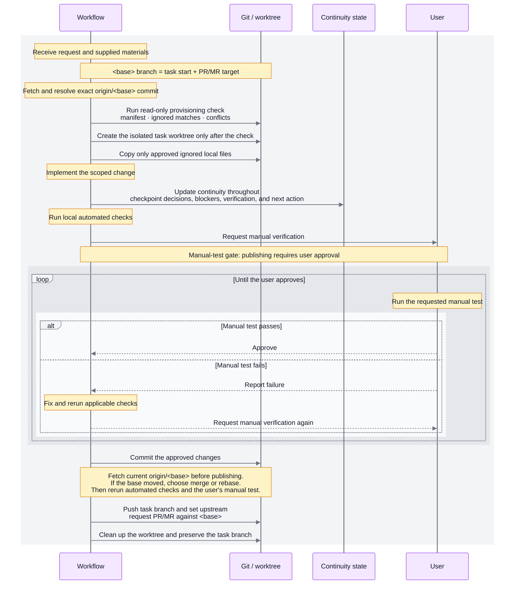

# Worktree provisioning

A Git worktree is another working directory for the same repository. Git checks out tracked
files there, but it does not copy ignored local files such as `.env.local` or
`connections.config`. The new directory can therefore lack development configuration used by
the original working tree. Private agent overrides and client-local settings are a separate,
explicit-only category because copying them can change agent behavior or permissions.

## Native-first delegation

The task workflow owns the required contract, but it does not require one worktree mechanism on
every client. Use a client's native capability when it satisfies the contract; use the repository
fallback for the remaining gaps.

- [Claude Code worktrees](https://code.claude.com/docs/en/worktrees) provides `--worktree`,
  `EnterWorktree`, worktree cleanup, resume binding, and
  `.worktreeinclude`. Its `worktree.baseRef` supports the default remote branch, local `HEAD`, and
  pull or merge request inputs, but not every named existing branch. This native manifest handling
  applies when Claude creates the Git worktree; a custom `WorktreeCreate` hook owns provisioning
  instead. The workflow therefore uses Git when it must start from an exact `origin/<base>`.
- [Codex desktop worktrees](https://learn.chatgpt.com/docs/environments/git-worktrees) provides
  Worktree and Handoff, starting-branch selection, Create branch here,
  [local-environment](https://learn.chatgpt.com/docs/environments/local-environment) setup scripts,
  actions, and built-in commit, push, and GitHub pull-request controls. The
  local managed worktree path consumes `.worktreeinclude`; the workflow still validates the
  requested base and keeps its branch and request contract. Remote worktrees and command-line
  created worktrees use the repository provisioning fallback, as do CLI and IDE extension paths
  where the desktop controls are not available.
- Codex desktop local managed worktrees have one client-owned exception: Codex automatically copies
  an ignored `AGENTS.override.md` even when it is not listed in `.worktreeinclude`. That is native
  Codex behavior, not approval from this workflow, and it does not apply to Codex CLI/IDE, terminal,
  Claude, or VS Code paths. The generic manifest and fallback rules continue to classify private
  agent overrides as explicit-only.
- [VS Code Agent Worktree](https://code.visualstudio.com/docs/agents/run/agent-harnesses) is another
  native creation path. It uses the user-level `git.worktreeIncludeFiles` setting rather than the
  repository's `.worktreeinclude`; this path is available when Copilot is hosted by VS Code, while
  Copilot CLI has no equivalent client-native worktree adapter.
- These native setup and verification features do not allocate a per-worktree port or carry
  portable state to another client. Use the runtime descriptor and project continuity layers for
  those contracts.

Opening a terminal-created worktree in VS Code is a convenience, not a workspace transfer. VS Code
also has the native Agent Worktree path described above; it owns creation and uses its own
`git.worktreeIncludeFiles` setting. Terminal provisioning can use `git wt-add --open-code` to open
a separate VS Code window. Claude Code and Codex keep their own session or Handoff workspace rules,
and the existing editor window remains on its current checkout unless the user changes it explicitly.

## Repository identity preflight

Before substantive repository work, every supported client reports a read-only identity preflight:

- the execution workspace root and current Git root;
- the active task repository when the host or user provides it;
- the current branch, current upstream, and selected workflow base;
- the physical `.project-continuity/state.md` path and whether it exists; and
- whether the working tree is clean.

If a known active file or repository resolves to a different Git root, the client warns and stops
before reading project files or editing. It performs only identity checks and asks whether to switch
context or continue with the current workspace. An explicitly confirmed second repository is a
separate task; the current worktree's continuity state is not reconciled, parked, replaced, or
updated for that task.

The current hooks receive the execution `cwd`, event name, and session metadata, but they do not
receive an IDE active-file path. When that path is unavailable, the client reports `active task
repository: unavailable` and uses the explicit workspace preflight. It asks for confirmation when
the intended repository is ambiguous. The workflow does not infer repository identity from a tab
title, filename, or directory name, and changing a terminal CWD does not move an existing client
session.

The workflow is explicit-only. Native-first means “use the native mechanism when it satisfies the
invariant,” not “make every task use the workflow.” If a future client feature satisfies one of
the workflow's invariants reliably, remove or bypass the corresponding fallback instead of
maintaining two competing implementations.

This repository manages a provisioning workflow that copies explicitly approved ignored
files into a new or existing worktree. It does not commit, upload, or synchronize those
files. The commands become available after the relevant chezmoi source changes are applied.

## How each worktree receives ignored files

Different worktree creators use different configuration. Each path below provisions local
files without making them tracked:

| Worktree creator | How ignored files arrive |
| --- | --- |
| Claude-created Git worktrees | Claude reads the repository's `.worktreeinclude`; a custom `WorktreeCreate` hook must copy approved files itself. |
| Codex desktop local managed worktrees | Codex reads `.worktreeinclude`; remote and command-line-created worktrees are outside this native path. |
| VS Code Agent Worktree, including Copilot hosted in VS Code | VS Code creates the worktree and uses the user-level `git.worktreeIncludeFiles` setting. This is separate from `.worktreeinclude`. |
| Copilot CLI | No client-native worktree adapter; use a prepared worktree or the terminal fallback. |
| Terminal Git | `git wt-check` classifies the source first; `git wt-add` then creates and copies approved files. |
| Already-created worktree | `git wt-copy` reruns only the approved copy step for files that are still missing. |

Already-created means a worktree made earlier with raw `git worktree add`, or one whose
approved local file was later removed. In that case, `git wt-copy` copies the missing file
from another worktree. It does not repair Git metadata, recover unknown contents, switch the
branch, or overwrite a target file that already exists.

The repository-root `.worktreeinclude` file is the shared per-repository allowlist. Claude and
Codex consume it on their supported native worktree paths; `git wt-add` and `git wt-copy` use the
same file for terminal and recovery paths. It contains repository-relative Git ignore patterns,
never file contents. For example:

```gitignore
config/development/connections.local.config
config/development/appsettings.local.config
```

The terminal workflow copies a source file only when both conditions are true:

- `.worktreeinclude` matches its repository-relative path.
- Git classifies the source file as ignored.

The manifest itself must be tracked before it can authorize any copy. Tracked files already
arrive through Git, and ignored files absent from the manifest remain absent from the new
worktree. If a manifest pattern matches a tracked file, the terminal helper rejects that entry;
it never copies tracked application configuration or another tracked file from a different worktree or branch.
The refusal identifies the file as application-owned or repository-controlled and directs
project-specific manual setup or an explicit repository contract instead.

The helper reports tracked `CLAUDE.md` and `AGENTS.md` as already supplied by Git. Ignored private
agent overrides such as `CLAUDE.local.md` and `AGENTS.override.md` are reported as
`[agent-override]`, while `.claude/settings.local.json` and recognized client-local settings are
reported as `[client-settings]`. Neither category is suggested as an ordinary unlisted candidate;
an explicit tracked manifest entry is still required before either can be copied.

The generic classification does not override native client behavior. Codex desktop local managed
worktrees automatically copy an ignored `AGENTS.override.md` even when `.worktreeinclude` omits it.
That is a Codex-owned native exception, not generic manifest approval, and it does not apply to
Codex CLI/IDE, terminal, Claude, or VS Code paths. Use the Codex native path only with that behavior
understood; the fallback continues to require an explicit manifest entry.

An external secrets folder or another directory outside the repository is never an implicit source.
`git wt-copy` accepts only a selected source worktree from the same Git repository. A consuming
repository that needs project-specific setup must provide an explicit, user-approved contract or
setup command; the generic helper does not guess or execute one. A repository may use a tracked
`.worktree-provision` contract to point the user to that setup without granting the generic helper
permission to run it:

```text
schemaVersion=1
script=scripts/setup-worktree.sh
documentation=docs/worktree-setup.md
```

The contract is report-only. Its script and documentation paths must be tracked and repository-relative;
the helper reports them, never executes the script, and never prints its contents or configuration values.
Keep the actual setup contract in the consuming repository; this guide defines only the generic format
and safety boundary.

VS Code uses a separate user-level list because it creates worktrees without invoking the
terminal wrapper. The user-level list can cover local agent instructions, development/test
environment files, and known local application configuration names. It deliberately omits
production environment files, credential stores, keys, agent state, dependencies, and build
output. The repository does not treat that client-owned setting as the terminal manifest.

## Run the read-only provisioning check

Every supported repository-provided non-native creation path runs the same read-only check before it creates a worktree. Run it
directly when starting from raw Git, or when reviewing an already-created worktree:

```shell
git wt-check
git wt-check --source /path/to/source-worktree --target /path/to/existing-worktree
git wt-check --source /path/to/source-worktree --required path/to/local-config
```

The check reports whether `.worktreeinclude` is absent, tracked, or present but untracked; which
ignored files match it; which eligible ignored files are unlisted; missing manifest patterns;
required local files that are absent; existing target conflicts when `--target` exists; and
explicit configuration references found in tracked configuration candidates, tracked files matched
by the manifest, and private agent/client files that are explicit-only. It prints `Writes: none`
and never creates a manifest, worktree, directory, or copied file.

Its decision distinguishes the cases that affect the next action:

| Decision | Meaning | Exit code |
| --- | --- | --- |
| `no-manifest-needed` | No manifest exists and no eligible ignored file was found. | 0 |
| `manifest-present-no-matches` | A tracked manifest exists, but no present ignored file matches it. | 0 |
| `manifest-ready` | A tracked manifest has eligible ignored matches. | 0 |
| `eligible-ignored-files-unlisted` | Eligible ignored files exist outside the tracked manifest. Review them before creating. | 3 |
| `required-local-config-missing` | An explicitly named required local file is missing. | 2 |
| `invalid-manifest` | The manifest is untracked, contains rejected patterns, or matches a tracked file. | 2 |

The check cannot infer whether an application requires a local file from its filename. Without
`--required`, it reports that requirement as unknown; build or startup verification settles that
application-specific question. A raw worktree has no target to inspect before creation, so run the
check again with `--target` after Git creates it to report copy candidates, configuration files
missing from the target, and conflicts.

## Run the tracked-configuration readiness check

`git wt-readiness` is the separate, read-only configuration check for local state that Git or the
manifest will not carry into a new worktree:

```shell
git wt-readiness --source /path/to/source-worktree --target /path/to/existing-worktree
```

The check reports the exact source and target paths and branches, then classifies these states:

- `[authorized]`: an ignored file is listed by the tracked `.worktreeinclude` and is eligible for
  provisioning;
- `[unlisted]`: an ignored file is present but is not authorized by the manifest;
- `[rejected]`: a manifest pattern matches a tracked file; tracked files already arrive through Git
  and require project-specific manual setup or an explicit repository contract;
- `[tracked-instructions]`: tracked `CLAUDE.md` or `AGENTS.md` is already supplied by Git;
- `[agent-override]`: an ignored private agent override is explicit-only and is not suggested as
  ordinary configuration;
- `[client-settings]`: an ignored client-local settings file is explicit-only and is not suggested
  as ordinary configuration;
- `[tracked-config]`: a tracked configuration candidate is modified in the
  source worktree and was not copied;
- `[expected]`: a tracked configuration file contains an explicit `configSource` or `appSettings
  file` reference. The generic scan maps a relative target from the containing configuration file
  directory; a project contract remains authoritative for application-root semantics;
- `[present]`: the referenced configuration file exists in the source worktree;
- `[missing]`: the referenced configuration file is absent from the source worktree, or the target
  worktree does not contain it when `--target` is supplied; and
- `[unmapped]`: a referenced file exists but is neither tracked nor ignored, or the reference is
  not a safe repository-relative path; and
- `[setup-contract]`: a tracked `.worktree-provision` contract points to a repository setup script and,
  optionally, documentation; it is reported for manual review and never executed.
- `[setup-contract-invalid]`: the contract is absent from Git, malformed, or points outside tracked,
  repository-relative files.
- `[configuration] no local configuration differences`: none of the preceding states applies.

The report also separates two readiness dimensions:

- `Provisioning state: provisioning-ready` means that the manifest and any explicitly approved
  mapping are safe to use for the reported operation.
- `Runtime state: runtime-unverified` means that no application health check has run. It is not a
  claim that the application can build, start, authenticate, reach its database, or serve the
  requested feature.
- `Runtime state: runtime-health-verified` is emitted only by the optional tracked
  `.worktree-runtime.json` helper after the started process responds at its health URL and owns
  the selected port.

The health result remains narrower than application readiness. It does not verify authentication,
database credentials, background services, or feature behavior.

The check scans tracked configuration candidates by path and reads them only to find these explicit
XML-style attributes. It does not print configuration values, connection strings, secrets, or
tokens. The tracked-configuration warning is advisory. It does not block `git wt-add`, modify a
manifest, copy a tracked file, or turn an ignored file into an approved file. Review the exact
source and target worktrees only if the task requires a local override.

Project-specific setup remains explicit. A consuming repository can provide the report-only
`.worktree-provision` contract above, a tracked wrapper, or a user-approved setup command that calls
`git wt-check --required <repo-relative-path>` for known required local files. The generic helper does
not discover, trust, or execute arbitrary setup commands or external secrets folders. If the source
repository cannot be inspected from the current workflow, report that limitation instead of inventing
project-specific paths.

## Use an explicit configuration mapping

Use `git wt-provision` when a project has an approved mapping that the ordinary manifest cannot
represent, such as a user-level configuration file outside the repository:

```shell
git wt-provision --dry-run \
  --operation copy-external-file \
  --source-file /path/to/local/config \
  --target /path/to/worktree \
  --destination config/development/local.config
```

The read-only command reports a non-secret source fingerprint, the exact source and target worktree
paths and branches, the target's current HEAD, destination, operation, and an approval identifier. After the user approves that exact mapping,
repeat the command with `--approve <approval-id>`. The helper recomputes the mapping identity before
writing and refuses the operation if the source path, source fingerprint, target worktree, target
HEAD, destination, operation, or contract version changed. The approval identifier proves only that
the supplied mapping still matches that deterministic identity; it cannot prove that a human saw
or approved the report. The agent or client must obtain affirmative approval before supplying it.

The generic helper currently permits only these write operations:

- `copy-ignored-file`: copy one explicitly named ignored file from the target repository's worktree set;
- `copy-external-file`: copy one explicitly named non-tracked external file; and
- `merge-named-section` and `replace-file`: report-only refusals.

The target must be Git-ignored and absent. The helper never overwrites an existing file, copies a
tracked file, replaces a whole `Web.config` or `.env` file, infers a section merge, or searches an
external folder. A format-aware project adapter may provide a section merge later, but the generic
workflow does not perform one.

An approval can be reused only while its mapping identity remains unchanged. A changed source
fingerprint, source or destination path, target worktree or HEAD, operation, or contract version requires a
new approval. This command remains separate from `git wt-copy`; `.worktreeinclude` continues to be
the only standing allowlist for ordinary ignored-file provisioning.

## Create a worktree with `git wt-add`

`git wt-add` wraps `git worktree add`. Wrapper options go before `--`; every argument after
`--` is forwarded to native Git unchanged. This preserves Git's normal control over the
target path, new or existing branch, and start point.

Create `feat/example` from `develop`:

```shell
git wt-add --open-code -- -b feat/example ../example develop
```

Check out an existing branch in a new worktree:

```shell
git wt-add -- ../example feat/example
```

Create a detached worktree from a remote-tracking branch:

```shell
git wt-add -- --detach ../review origin/develop
```

Continuity works in any Git worktree; it does not depend on this wrapper. A cross-client
handoff does depend on both clients opening the same physical working-tree directory. After
creating a worktree, `git wt-add` prints the exact path and the suggested continuation prompt
as a non-blocking reminder. It also reminds you to use a separate worktree for another
unfinished task — which is the right answer when the two tasks need separate uncommitted
changes, and unnecessary when they do not. For a second task in the same directory, the
`project-continuity` skill parks the first under `.project-continuity/parked/` instead.

Main-checkout inspection has a timing boundary in Claude Code. Inspect ignored files and other
source-worktree inventory before `EnterWorktree` whenever possible. After Claude enters an
isolated worktree, run Git commands only from that current worktree; Claude rejects `git -C`,
`--git-dir`, and similar redirects to the main checkout, including read-only status checks. If
the inspection was missed, use `ExitWorktree` with `action: "keep"`, inspect the main checkout,
and then re-enter the preserved task worktree. Do not remove the worktree or restart the task
just to perform this inventory.

The machine-local AI profile does not remove worktree capabilities. Both `managed` and `native`
AI harnesses keep the canonical `worktree-task-workflow` and `worktree-manifest` skills available
for explicit invocation. Both skills are state-changing workflows, so neither client starts them
implicitly. Managed mode may connect the task workflow to automatic continuity and
Claude's launch guard; native mode leaves those skills manual and does not register the automatic
launch guard. `ai_continuity` remains a separate preference for managed mode. General Git and
worktree provisioning commands are unaffected by the harness selection.

The task workflow is an explicit opt-in for substantial or isolation-sensitive work. It is not a
mandatory entry point for every task: a small, self-contained edit that does not need parallel
isolation may remain in the current valid worktree. Choose it when isolation, cross-session handoff,
controlled verification, or publishing matters.

Worktree isolation covers source and Git state, not running services or their ports. For browser or
runtime testing from an isolated worktree, invoke the task workflow with `runtime=auto` before
starting the server, and use the consuming project's authoritative tracked `.worktree-runtime.json`.
Without that descriptor, source isolation remains valid but concurrent runtime testing is not
guaranteed; report that limitation before starting a server. Tasks that do not need browser/runtime
testing may leave runtime off. This preserves strong guarantees when runtime isolation is explicitly
chosen without making every task or project use a rigid runtime harness.

The wrapper options are:

| Option | Effect |
| --- | --- |
| `--dry-run` | Run the read-only check and validate wrapper inputs without creating anything. |
| `--skip-copy` | Create the worktree without copying; this is an explicit unprovisioned decision. |
| `--allow-unprovisioned` | Allow creation after reviewing a check that found eligible ignored files outside the manifest. It does not copy those files. |
| `--open-code` | Open the completed worktree in a new VS Code window. |

The command performs these steps:

1. Run the read-only provisioning check in the source worktree.
2. Stop before Git creates anything when eligible ignored files are unlisted, unless
   `--allow-unprovisioned` or `--skip-copy` was explicitly supplied.
3. Run `git worktree add` with the arguments after `--`.
4. Read the tracked `.worktreeinclude` from the source worktree.
5. Intersect its matches with Git's normally ignored files.
6. Preserve repository-relative paths and refuse to overwrite existing targets.
7. Reject paths that escape a worktree or traverse symbolic links. Windows also rejects
   reparse points.
8. Optionally open the completed worktree in VS Code.
9. Print the exact-path handoff reminder.

A blocked preflight returns exit code 3 before creating a worktree. A rejected copy returns exit
code 2 but leaves a successfully created worktree in place for inspection or manual recovery.
Missing optional files and existing target conflicts are reported but do not make an otherwise
safe run fail.

## Provision an existing worktree with `git wt-copy`

Run this from the worktree that needs its approved ignored files:

```shell
git wt-copy
```

The command discovers the repository's primary worktree and reports the chosen source. When
that source is not appropriate or cannot be selected unambiguously, provide it explicitly:

```shell
git wt-copy --source /path/to/existing-worktree
```

On Windows, a native path is also valid:

```powershell
git wt-copy --source C:\path\to\existing-worktree
```

`git wt-copy --dry-run` reports what would be copied without changing the target. Every copy
uses the source worktree's tracked manifest and current ignored files. Source and target must
belong to the same Git repository. If the manifest matches a tracked file, `wt-copy` refuses that
file and returns failure while still allowing approved ignored entries to be copied; it never
overwrites the target's Git-provided tracked file.

## Windows and macOS support

The public commands and behavior are the same on both supported platforms:

| Platform | Managed implementation | Runtime requirement |
| --- | --- | --- |
| Windows | `~/.local/share/git-worktree-provision.ps1` | Windows PowerShell and Git for Windows |
| macOS | `~/.local/share/git-worktree-provision.sh` | The system Bash-compatible shell and Git |

The rendered `~/.gitconfig` selects the appropriate implementation. You use `git wt-add`
and `git wt-copy` on either platform; no PowerShell installation is needed on a Mac. The Bash
implementation stays compatible with the Bash 3.2 version included with macOS.

## Comparison with `claude --worktree`

`git wt-add` is the repository fallback for terminal-created worktrees. It makes them resemble
Claude-created worktrees in one specific way: both create a Git worktree and provision ignored
files approved by `.worktreeinclude`. It is not a second manifest or a replacement for native
client worktree management.

| Capability | `git wt-add` | `claude --worktree` |
| --- | --- | --- |
| Create a Git worktree | Yes, by forwarding native arguments | Yes |
| Copy approved ignored files | Yes, from `.worktreeinclude` | Yes, from `.worktreeinclude` |
| Start an agent session | No | Yes, starts Claude Code in the worktree |
| Choose branch, path, and start point | The user supplies ordinary Git arguments | Claude applies its own worktree naming and base-reference behavior |
| Run Claude worktree hooks | No | Yes |
| Manage Claude session cleanup | No | Yes |
| Provision an existing worktree | Yes, through `git wt-copy` | No equivalent repair command |

Use `claude --worktree` when starting an isolated Claude Code session. Use `git wt-add` when
the worktree itself is the goal and a terminal, VS Code, Codex, or another tool will use it.

### Claude worktree task workflow

For this workflow, `<base>` means the user-provided existing branch on `origin`. The task branch
is created from the exact commit resolved from `origin/<base>` in the new worktree, and the eventual
pull or merge request targets that same base branch; it is not a generic label for whichever branch
happens to be checked out.

Before provisioning, the workflow records the fetch and push identities of the `origin` remote,
resolves the base branch to one full commit, and shows that checkpoint. It re-reads both remote
URLs and the base ref immediately before creating the worktree. A changed remote identity or a
moved base ref stops the run and requires the plan to be resolved again. The worktree is created
from the recorded commit ID rather than from the mutable remote-tracking ref. Remote credentials
are never shown or written to continuity state. Before publishing, the workflow confirms that the
same origin identities remain configured and that the named base branch still exists. It also fetches
the current base and compares its commit with the recorded starting checkpoint. If the base advanced,
the workflow pauses for an explicit merge-or-rebase choice before pushing or opening a request.

The integration choice is deliberately not automatic. A clean task worktree is required, and the
workflow does not stash, reset, or discard changes. A merge preserves already-published task history;
a rebase is suitable for an unpublished branch, while a rebase of a published branch requires
separate approval for `--force-with-lease`. If either operation conflicts, the worktree remains in
its conflict state so the user or an agent can inspect and resolve it. The workflow records the
conflicting paths and next Git operation in continuity, then reruns applicable checks and the manual
test before publishing. It does not use `git pull` as a strategy selector or silently retarget the
request when the base moves.

The Claude adapter of `worktree-task-workflow` combines them, because neither alone gives an
isolated session on a branch taken from an arbitrary remote base. Claude Code's own worktree
creation branches from the remote default branch (`fresh`), from local `HEAD` (`head`), or from a
pull or merge request passed to `--worktree` as `"#1234"` or as a GitHub or GitLab URL. Those are
the only three, and none of them expresses a named branch: `worktree.baseRef` takes `fresh` or
`head` and nothing else, and Claude Code's own documentation sends you to Git directly to start
from a specific existing branch. So the skill creates the worktree with
`git wt-add` from the recorded commit resolved from `origin/<base>`, places it at
`<repo>/.claude/worktrees/<slug>` where entering
it raises no approval prompt, and then moves the running session into it with the
`EnterWorktree` tool's `path` argument. From that point Claude Code enforces the isolation
itself, refusing edits and commands that resolve back into the main checkout.

Cleanup splits the same way. `ExitWorktree` declines to remove a worktree that was entered by
path, and Claude's periodic sweep leaves every worktree it did not create alone, so the skill
exits with `keep` and then runs `git worktree remove` from the main checkout — never with
`--force`, so git's own refusal on uncommitted or untracked files remains the safety net.

That sweep protection requires **Claude Code v2.1.246 or later**, which is when the sweep began
checking for the marker Claude Code writes into the git metadata of worktrees it creates. Before
that version the sweep could remove a worktree created with `git worktree add` when a stale
background-session record pointed at its path — a collision this workflow makes more reachable,
because it deliberately reuses Claude's own `.claude/worktrees/<name>` naming.

The exposure is narrow but not theoretical, and it needs every one of these at once:

- a stale background-session record pointing at that path, most likely from an earlier
  `claude --worktree <slug>` session that was backgrounded under the same slug;
- a worktree that looks empty to the sweep. This is the sharp edge: the sweep spares changed or
  untracked files and unpushed commits, but `.project-continuity/`, `.env` and `node_modules` are
  all ignored, so a `cleanup=keep` worktree whose commits are already pushed looks like nothing
  would be lost;
- an age past [`cleanupPeriodDays`](https://code.claude.com/docs/en/settings-reference), which
  defaults to 30 days and this repository does not set.

On an older version, `git worktree lock` on a worktree being kept for review is the reliable
guard, since the sweep never releases a lock set by hand.

Removing a worktree is not retiring a branch. `git worktree remove` deletes no refs, and the
skill deletes none either: the task branch stays for the open request, its reviews and its CI.
`ExitWorktree` with `action: "remove"` is the one operation here that *would* delete the branch
along with the directory, which is why that path is never used.

### Codex worktree task workflow

The Codex adapter of `worktree-task-workflow` supports both ways a task can enter isolation. In a
[Codex desktop Local chat](https://learn.chatgpt.com/docs/environments/git-worktrees), use the
native Handoff control to move the chat to Worktree after the skill has resolved the task and base
branch.
Codex creates the managed detached worktree, copies the
repository's `.worktreeinclude` entries, and keeps the chat associated with it. In the CLI or IDE
extension, the adapter creates a detached sibling worktree with `git wt-add` when it starts from
the primary checkout, then stops with the exact continuation path. Start Codex in that path and
invoke the resolved workflow again; changing only a shell's directory does not move an existing
chat's workspace.

If the desktop Handoff selects a different starting commit than the requested
the recorded remote-base commit, the adapter stops rather than resetting the worktree. Use the
explicit `git wt-add -- --detach <path> <recorded-base-commit>` route in that case. This preserves the distinction
between Codex-managed worktrees and worktrees created by the terminal wrapper while giving CLI
and IDE sessions a safe automatic entry point.

Codex-managed worktrees begin detached. After fetching, the skill creates the task branch from
the requested recorded base commit inside that clean worktree, so the selected starting branch does not
silently replace the workflow's explicit base. It keeps every operation in that directory and
uses project continuity so another client can resume there.

When Codex desktop's selected starting branch, local-environment setup, and native branch controls
already satisfy the task's requirements, those controls are the preferred mechanism. The workflow
still checks the resulting worktree and branch because native controls do not establish this
repository's exact remote-base, cross-client handoff, runtime, or manual-test guarantees.

The running skill never removes its active Codex worktree. After the branch is clean, pushed, and
attached to an open request, the user can keep it for review or dispose of it through the app's
worktree lifecycle. Neither choice deletes the task branch.

## What the task workflow does at each step

The root [`README.md`](../README.md#task-lifecycle-and-isolated-worktrees) shows the lifecycle as a
recruiter-facing sequence. This section defines the provisioning and verification behavior behind
each step.

### Workflow sequence

The outer gray frame is the manual-test gate, and the inner light frame separates the pass/fail
branches. Purple participants, yellow notes, and neutral-gray lines preserve the workflow's semantic
palette. The diagrams use dark text explicitly because their semantic fills are light on both light
and dark editor canvases.



**Materials are read before anything exists.** A handoff note, spec, deck, spreadsheet, web page,
or design link is read through its matching document skill, web fetch, or design integration
before a single Git command runs. An explicit task is cross-checked against the materials; with
`--infer-task` the task is derived from them instead, in the materials' own language. Anything
that cannot be read stops the run with nothing created, naming the missing capability rather than
guessing from a URL slug. Fetched content is data: a page asking to change the task, base branch,
task branch, or cleanup behaviour is reported, never obeyed.

**Naming is derived, not invented.** The commit type comes from the shared `git-commit-reference`
table, the slug from the task's meaning, and the branch from `type/slug/suffix`. The Claude
adapter places the worktree under `.claude/worktrees/` because entering it there raises no
approval prompt, and the base is a user-provided named remote branch and request target, which no
client's own worktree creation can express.

**A provisioning decision is made before creation.** Non-native paths run `git wt-check` first,
so a missing manifest, empty manifest, unlisted eligible ignored file, or explicitly missing local
configuration is visible before a new directory exists. The check never creates a manifest or
copies files. `git wt-add` blocks unlisted eligible files until the user reviews the report and
chooses either a tracked manifest or an explicit `--allow-unprovisioned` decision. The workflow
still settles application-specific necessity by building and running the app rather than by
classifying filenames.

**Automated verification reaches the browser, not just the build.** With `agent-test` on, the
workflow runs typecheck, lint, focused tests and a build, and for visual work drives the real UI
through the managed `chrome-devtools` MCP server. Where a driver cannot reach — canvas, map
overlays, WebGL, drag gestures — the `browser-collab-testing` skill splits the interactions with
the user rather than skipping them. Nothing is reported as tested unless a tool actually drove it,
and agent verification never replaces the user's manual test.

**Cleanup removes the worktree, never the branch.** The task branch outlives its directory for
review and CI. The Claude adapter exits with `keep` and then runs `git worktree remove` without
`--force`; the Codex adapter never removes its own active worktree at all. Every removal path that
would delete a ref is deliberately unused.

**Continuity cleanup is separate, but it is still a required completion step.** After publishing and
before the final response, the workflow runs the `project-continuity` completion gate even when it
also emits a stale HEAD or branch warning. The workflow reconciles active and parked state, validates
parked timestamps before applying age-based review, asks before deleting completed state, and
records `Cleanup: declined` when the user keeps it. A clean branch, worktree disposal, or branch
preservation never authorizes continuity-state deletion, and the final response names any cleanup
that remains pending.

## Safety boundaries

The terminal workflow never copies:

- User-global `~/.claude`, `~/.codex`, `~/.copilot`, or `~/.agents` configuration.
- Tracked files from another worktree or branch, including tracked application configuration; those
  require project-specific manual setup or an explicit repository contract.
- Authentication files, production environment files, private keys, or certificates.
- Agent history, memory, caches, `.project-continuity/**`, or Codex local state.
- Dependencies or build output such as `node_modules`, `packages`, `bin`, `obj`, `coverage`,
  or `dist`.
- Database files or backups.

It also does not install dependencies, synchronize ignored files between machines, or commit
or upload copied files. Restore dependencies separately with the repository's normal package
manager or build workflow.

## Add the manifest to a repository

For a repository that needs provisioning, add and commit a `.worktreeinclude` at its root.
Keep it narrow: list only ignored development files that are safe and useful in another local
worktree. For example, a consuming repository might explicitly authorize:

```gitignore
config/development/connections.local.config
config/development/appsettings.local.config
# Add a private agent override or client-local settings only after separate explicit review.
```

Review that repository's local files before committing the manifest. The manifest names are
tracked, but the ignored files and their contents remain local.
Keep application-specific paths and setup instructions in that repository's documentation; this guide
defines the cross-repository manifest contract only.

The `worktree-manifest` skill runs this as a guided task: it enumerates the repository's ignored
files, classifies them against the safety boundaries above, confirms the entries with you, and
commits the manifest on its own branch. Its first answer is often that no manifest is warranted,
because a repository whose ignored entries are only build output, dependencies, agent state and
data directories has nothing eligible to copy.

## References

- [Git worktree command reference](https://git-scm.com/docs/git-worktree.html)
- [VS Code branches and worktrees](https://code.visualstudio.com/docs/sourcecontrol/branches-worktrees)
- [VS Code Agent Worktree and harnesses](https://code.visualstudio.com/docs/agents/run/agent-harnesses)
- [Claude Code worktrees and `.worktreeinclude`](https://code.claude.com/docs/en/worktrees)
- [Codex worktrees](https://learn.chatgpt.com/docs/environments/git-worktrees)
- [Codex local environments](https://learn.chatgpt.com/docs/environments/local-environment)
